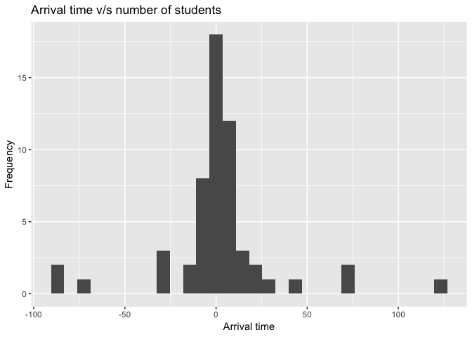
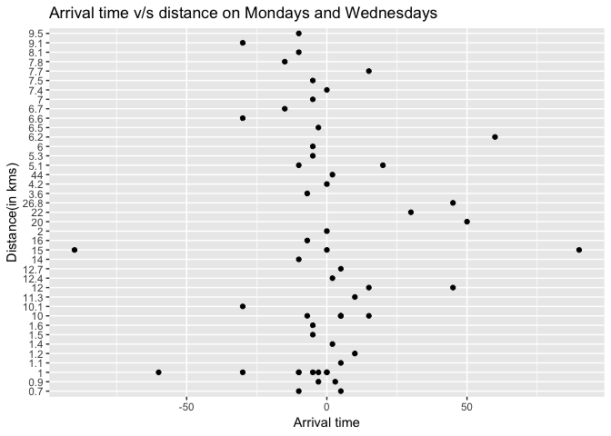

Exploratory data analysis
================
Akansha Vashisth
2019-04-03

### Survey question

**How does distance from campus influence arrival time to lectures?**

### Collected data

    ## Parsed with column specification:
    ## cols(
    ##   StartDate = col_character(),
    ##   EndDate = col_character(),
    ##   Status = col_character(),
    ##   Progress = col_character(),
    ##   `Duration (in seconds)` = col_character(),
    ##   Finished = col_character(),
    ##   RecordedDate = col_character(),
    ##   ResponseId = col_character(),
    ##   DistributionChannel = col_character(),
    ##   UserLanguage = col_character(),
    ##   Q1 = col_character(),
    ##   Q3 = col_character(),
    ##   Q4 = col_character(),
    ##   Q5 = col_character()
    ## )

### Cleaning data

    ## Warning: Unknown levels in `f`: 1, 2, 3, 4

### Cleaned data

    ## # A tibble: 112 x 3
    ##    distance_km arrival mode_of_transport
    ##    <chr>         <dbl> <fct>            
    ##  1 1.1               5 Walking          
    ##  2 5.1              20 Transit          
    ##  3 20               50 Driving          
    ##  4 7.4               0 Transit          
    ##  5 1                 0 Walking          
    ##  6 12.4              2 Cycling          
    ##  7 12               15 Driving          
    ##  8 10                5 Transit          
    ##  9 15               90 Driving          
    ## 10 10                5 Transit          
    ## # ... with 102 more rows

### Variables in the data

1.  distance\_km: Distance travelled in kilometers. This is numeric variable.
2.  mw\_arrival: Arrival time in class on Mondays and Wednesdays. This is numeric variable.
3.  tt\_arrival: Arrival time in class on Tuesdays and Thursdays. This is numeric variable.
4.  mode\_of\_transport: Mode of transportation used to travel. This is categorical variable.

### TABLE OF SUMMARY STATISTICS

    ##  distance_km           arrival         mode_of_transport
    ##  Length:112         Min.   :-90.0000   Cycling: 8       
    ##  Class :character   1st Qu.: -7.0000   Driving:14       
    ##  Mode  :character   Median :  0.0000   Transit:58       
    ##                     Mean   :  0.7946   Walking:32       
    ##                     3rd Qu.:  5.0000                    
    ##                     Max.   :120.0000

    ## clean_survey_all_days$mode_of_transport: Cycling
    ##  distance_km           arrival      mode_of_transport
    ##  Length:8           Min.   :-7.00   Cycling:8        
    ##  Class :character   1st Qu.:-5.00   Driving:0        
    ##  Mode  :character   Median :-2.50   Transit:0        
    ##                     Mean   :-2.25   Walking:0        
    ##                     3rd Qu.: 0.50                    
    ##                     Max.   : 2.00                    
    ## -------------------------------------------------------- 
    ## clean_survey_all_days$mode_of_transport: Driving
    ##  distance_km           arrival       mode_of_transport
    ##  Length:14          Min.   :-90.00   Cycling: 0       
    ##  Class :character   1st Qu.:  0.00   Driving:14       
    ##  Mode  :character   Median : 15.00   Transit: 0       
    ##                     Mean   : 17.50   Walking: 0       
    ##                     3rd Qu.: 48.75                    
    ##                     Max.   :120.00                    
    ## -------------------------------------------------------- 
    ## clean_survey_all_days$mode_of_transport: Transit
    ##  distance_km           arrival         mode_of_transport
    ##  Length:58          Min.   :-85.0000   Cycling: 0       
    ##  Class :character   1st Qu.: -7.0000   Driving: 0       
    ##  Mode  :character   Median :  0.0000   Transit:58       
    ##                     Mean   :  0.3276   Walking: 0       
    ##                     3rd Qu.:  5.0000                    
    ##                     Max.   : 75.0000                    
    ## -------------------------------------------------------- 
    ## clean_survey_all_days$mode_of_transport: Walking
    ##  distance_km           arrival        mode_of_transport
    ##  Length:32          Min.   :-60.000   Cycling: 0       
    ##  Class :character   1st Qu.:-10.000   Driving: 0       
    ##  Mode  :character   Median : -3.000   Transit: 0       
    ##                     Mean   : -4.906   Walking:32       
    ##                     3rd Qu.:  3.000                    
    ##                     Max.   : 25.000

### EDA

    ## `stat_bin()` using `bins = 30`. Pick better value with `binwidth`.

    ## `stat_bin()` using `bins = 30`. Pick better value with `binwidth`.

### Conclusion

(open to all) &gt; Based on the EDA
