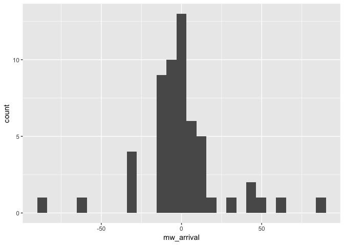
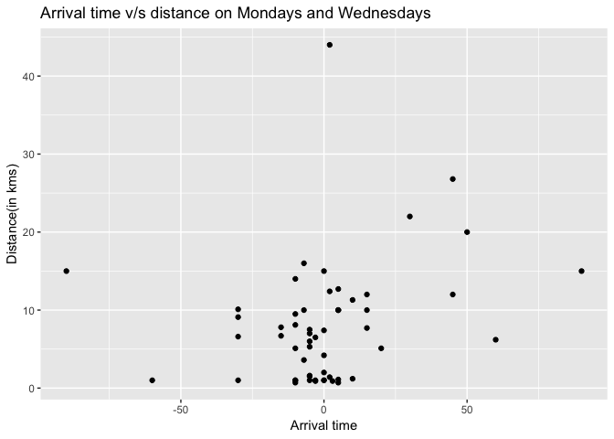
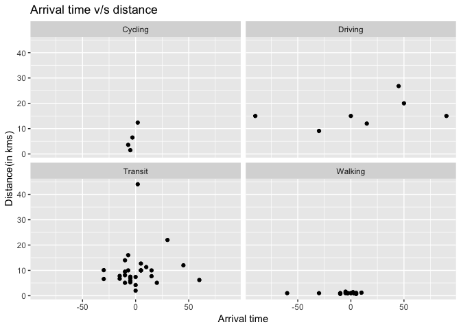
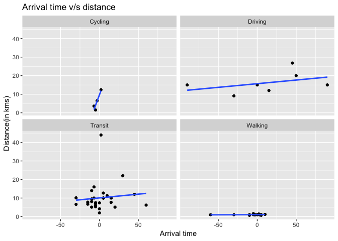
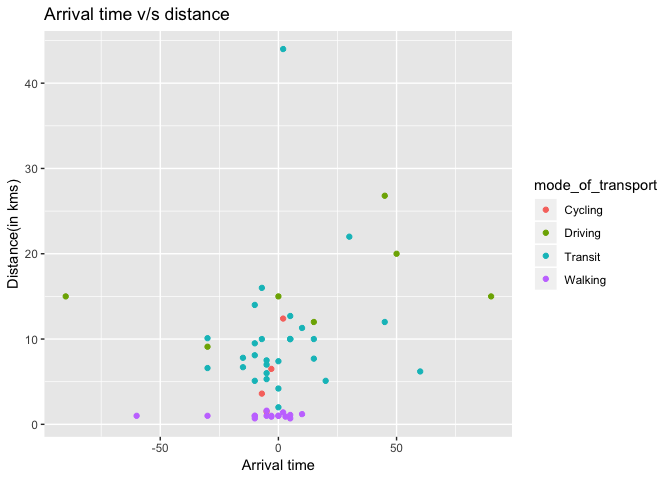
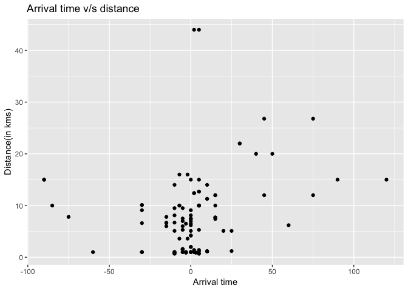
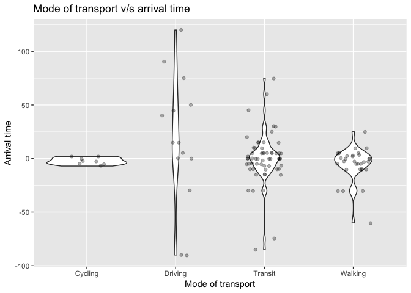
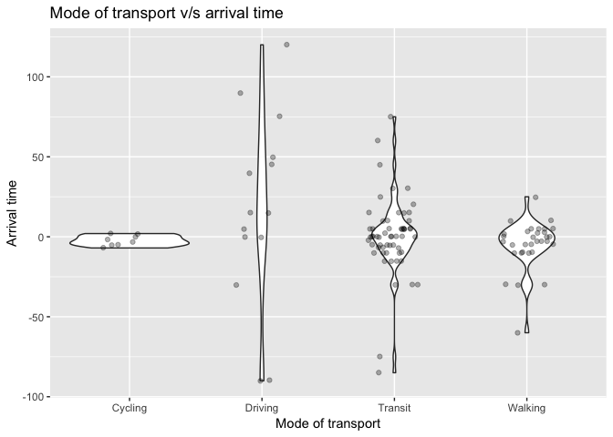

eda
================
Akansha Vashisth
2019-04-03

``` r
library(ggplot2)
library(tidyverse)
```

    ## ── Attaching packages ────────────────────────────────── tidyverse 1.2.1.9000 ──

    ## ✔ tibble  1.4.2     ✔ dplyr   0.7.6
    ## ✔ tidyr   0.8.1     ✔ stringr 1.4.0
    ## ✔ readr   1.1.1     ✔ forcats 0.3.0
    ## ✔ purrr   0.2.5

    ## Warning: package 'stringr' was built under R version 3.5.2

    ## ── Conflicts ────────────────────────────────────────── tidyverse_conflicts() ──
    ## ✖ dplyr::filter() masks stats::filter()
    ## ✖ dplyr::lag()    masks stats::lag()

``` r
library(lubridate)
```

    ## 
    ## Attaching package: 'lubridate'

    ## The following object is masked from 'package:base':
    ## 
    ##     date

### Survey question

**How does distance from campus influence arrival time to lectures?**

### Collected data

``` r
# Initial survey data to go here
initial_survey <- read_csv('data/Arrival Time_April 4, 2019_08.20.csv')
```

    ## Parsed with column specification:
    ## cols(
    ##   StartDate = col_character(),
    ##   EndDate = col_character(),
    ##   Status = col_character(),
    ##   Progress = col_character(),
    ##   `Duration (in seconds)` = col_character(),
    ##   Finished = col_character(),
    ##   RecordedDate = col_character(),
    ##   ResponseId = col_character(),
    ##   DistributionChannel = col_character(),
    ##   UserLanguage = col_character(),
    ##   Q1 = col_character(),
    ##   Q3 = col_character(),
    ##   Q4 = col_character(),
    ##   Q5 = col_character()
    ## )

### Preprocessing on data

``` r
# Ian please put your lovely code here :)

clean_survey_sep_days <- initial_survey %>%
  select(contains('Q')) %>%
  slice(-c(1:2)) %>%
  rename('distance_km' = 'Q1',
         'mw_arrival' = 'Q3',
         'tt_arrival' = 'Q4',
         'mode_of_transport' = 'Q5') %>% 
  mutate(mw_arrival = hm(mw_arrival),
         mw_arrival = hour(mw_arrival)*60 + minute(mw_arrival),
         mw_arrival = if_else(mw_arrival < 400, 540 + mw_arrival, mw_arrival),
         mw_arrival = 9*60 - mw_arrival) %>%
  mutate(tt_arrival = hm(tt_arrival),
         tt_arrival = hour(tt_arrival)*60 + minute(tt_arrival),
         tt_arrival = if_else(tt_arrival < 430, 570 + tt_arrival, tt_arrival),
         tt_arrival = 9.5*60 - tt_arrival) %>%
  mutate(mode_of_transport = fct_recode(mode_of_transport, 
                                        driving = '1',
                                        transit = '2',
                                        walking = '3',
                                        cycling = '4'))
```

    ## Warning: Unknown levels in `f`: 1, 2, 3, 4

``` r
clean_survey_sep_days
```

    ## # A tibble: 56 x 4
    ##    distance_km mw_arrival tt_arrival mode_of_transport
    ##    <chr>            <dbl>      <dbl> <fct>            
    ##  1 1.1                  5         10 Walking          
    ##  2 5.1                 20         25 Transit          
    ##  3 20                  50         40 Driving          
    ##  4 7.4                  0         15 Transit          
    ##  5 1                    0          0 Walking          
    ##  6 12.4                 2          2 Cycling          
    ##  7 12                  15         15 Driving          
    ##  8 10                   5          5 Transit          
    ##  9 15                  90        120 Driving          
    ## 10 10                   5        -85 Transit          
    ## # ... with 46 more rows

``` r
clean_survey_sep_days$distance_km <- as.numeric(clean_survey_sep_days$distance_km)


View(clean_survey_sep_days)

levels(clean_survey_sep_days$mode_of_transport)
```

    ## [1] "Cycling" "Driving" "Transit" "Walking"

``` r
clean_survey_mw <- clean_survey_sep_days %>% 
  select(-c(tt_arrival)) %>% 
  rename(arrival = mw_arrival)

clean_survey_tt <- clean_survey_sep_days %>% 
  select(-c(mw_arrival)) %>% 
  rename(arrival = tt_arrival)

clean_survey_all_days <- bind_rows(clean_survey_mw, clean_survey_tt)
```

### Cleaned data

``` r
survey_data <- read_csv("data/clean_survey_responses.csv")
```

    ## Parsed with column specification:
    ## cols(
    ##   distance_km = col_double(),
    ##   mw_arrival = col_integer(),
    ##   tt_arrival = col_integer(),
    ##   mode_of_transport = col_character()
    ## )

``` r
head(survey_data)
```

    ## # A tibble: 6 x 4
    ##   distance_km mw_arrival tt_arrival mode_of_transport
    ##         <dbl>      <int>      <int> <chr>            
    ## 1         1.1          5         10 walking          
    ## 2         5.1         20         25 transit          
    ## 3        20           50         40 driving          
    ## 4         7.4          0         15 transit          
    ## 5         1            0          0 walking          
    ## 6        12.4          2          2 cycling

### Variables in the data

1.  distance\_km: Distance travelled in kilometers. This is numeric variable.
2.  mw\_arrival: Arrival time in class on Mondays and Wednesdays. This is numeric variable.
3.  tt\_arrival: Arrival time in class on Tuesdays and Thursdays. This is numeric variable.
4.  mode\_of\_transport: Mode of transportation used to travel. This is categorical variable.

### Cleaning data

``` r
survey_data$mode_of_transport <- as.factor(survey_data$mode_of_transport)

clean_survey_sep_days
```

    ## # A tibble: 56 x 4
    ##    distance_km mw_arrival tt_arrival mode_of_transport
    ##          <dbl>      <dbl>      <dbl> <fct>            
    ##  1         1.1          5         10 Walking          
    ##  2         5.1         20         25 Transit          
    ##  3        20           50         40 Driving          
    ##  4         7.4          0         15 Transit          
    ##  5         1            0          0 Walking          
    ##  6        12.4          2          2 Cycling          
    ##  7        12           15         15 Driving          
    ##  8        10            5          5 Transit          
    ##  9        15           90        120 Driving          
    ## 10        10            5        -85 Transit          
    ## # ... with 46 more rows

``` r
typeof(clean_survey_sep_days$distance_km)
```

    ## [1] "double"

``` r
clean_survey_sep_days$distance_km <- as.numeric(clean_survey_sep_days$distance_km)

clean_survey_all_days
```

    ## # A tibble: 112 x 3
    ##    distance_km arrival mode_of_transport
    ##          <dbl>   <dbl> <fct>            
    ##  1         1.1       5 Walking          
    ##  2         5.1      20 Transit          
    ##  3        20        50 Driving          
    ##  4         7.4       0 Transit          
    ##  5         1         0 Walking          
    ##  6        12.4       2 Cycling          
    ##  7        12        15 Driving          
    ##  8        10         5 Transit          
    ##  9        15        90 Driving          
    ## 10        10         5 Transit          
    ## # ... with 102 more rows

``` r
typeof(clean_survey_all_days$distance_km)
```

    ## [1] "double"

``` r
dim(survey_data)
```

    ## [1] 48  4

``` r
dim(clean_survey_sep_days)
```

    ## [1] 56  4

``` r
dim(clean_survey_all_days)
```

    ## [1] 112   3

### TABLE OF SUMMARY STATISTICS

``` r
summary(clean_survey_all_days) %>% 
  knitr::kable()
```

|     |  distance\_km  |      arrival     | mode\_of\_transport |
|-----|:--------------:|:----------------:|:--------------------|
|     |  Min. : 0.700  |  Min. :-90.0000  | Cycling: 8          |
|     | 1st Qu.: 1.350 | 1st Qu.: -7.0000 | Driving:14          |
|     | Median : 6.850 |  Median : 0.0000 | Transit:58          |
|     |  Mean : 7.995  |   Mean : 0.7946  | Walking:32          |
|     | 3rd Qu.:10.400 |  3rd Qu.: 5.0000 | NA                  |
|     |  Max. :44.000  |  Max. :120.0000  | NA                  |

``` r
summary(clean_survey_sep_days) %>% 
  knitr::kable()
```

|     |  distance\_km  |    mw\_arrival   |   tt\_arrival   | mode\_of\_transport |
|-----|:--------------:|:----------------:|:---------------:|:--------------------|
|     |  Min. : 0.700  |  Min. :-90.0000  |  Min. :-90.000  | Cycling: 4          |
|     | 1st Qu.: 1.350 | 1st Qu.:-10.0000 | 1st Qu.: -5.000 | Driving: 7          |
|     | Median : 6.850 | Median : -1.5000 |  Median : 0.000 | Transit:29          |
|     |  Mean : 7.995  |   Mean : 0.1607  |   Mean : 1.429  | Walking:16          |
|     | 3rd Qu.:10.400 |  3rd Qu.: 5.0000 |  3rd Qu.: 5.000 | NA                  |
|     |  Max. :44.000  |  Max. : 90.0000  |  Max. :120.000  | NA                  |

``` r
# by mode of transit
by(clean_survey_all_days, clean_survey_all_days$mode_of_transport, summary)
```

    ## clean_survey_all_days$mode_of_transport: Cycling
    ##   distance_km        arrival      mode_of_transport
    ##  Min.   : 1.500   Min.   :-7.00   Cycling:8        
    ##  1st Qu.: 3.075   1st Qu.:-5.00   Driving:0        
    ##  Median : 5.050   Median :-2.50   Transit:0        
    ##  Mean   : 6.000   Mean   :-2.25   Walking:0        
    ##  3rd Qu.: 7.975   3rd Qu.: 0.50                    
    ##  Max.   :12.400   Max.   : 2.00                    
    ## -------------------------------------------------------- 
    ## clean_survey_all_days$mode_of_transport: Driving
    ##   distance_km       arrival       mode_of_transport
    ##  Min.   : 9.10   Min.   :-90.00   Cycling: 0       
    ##  1st Qu.:12.75   1st Qu.:  0.00   Driving:14       
    ##  Median :15.00   Median : 15.00   Transit: 0       
    ##  Mean   :16.13   Mean   : 17.50   Walking: 0       
    ##  3rd Qu.:18.75   3rd Qu.: 48.75                    
    ##  Max.   :26.80   Max.   :120.00                    
    ## -------------------------------------------------------- 
    ## clean_survey_all_days$mode_of_transport: Transit
    ##   distance_km       arrival         mode_of_transport
    ##  Min.   : 2.00   Min.   :-85.0000   Cycling: 0       
    ##  1st Qu.: 6.60   1st Qu.: -7.0000   Driving: 0       
    ##  Median : 8.10   Median :  0.0000   Transit:58       
    ##  Mean   :10.15   Mean   :  0.3276   Walking: 0       
    ##  3rd Qu.:10.10   3rd Qu.:  5.0000                    
    ##  Max.   :44.00   Max.   : 75.0000                    
    ## -------------------------------------------------------- 
    ## clean_survey_all_days$mode_of_transport: Walking
    ##   distance_km       arrival        mode_of_transport
    ##  Min.   :0.700   Min.   :-60.000   Cycling: 0       
    ##  1st Qu.:0.975   1st Qu.:-10.000   Driving: 0       
    ##  Median :1.000   Median : -3.000   Transit: 0       
    ##  Mean   :1.031   Mean   : -4.906   Walking:32       
    ##  3rd Qu.:1.025   3rd Qu.:  3.000                    
    ##  Max.   :1.600   Max.   : 25.000

### EDA

``` r
### INITIAL HISTOGRAMS FOR MW & TT

clean_survey_sep_days %>% 
  ggplot(aes(x = mw_arrival)) +
  geom_histogram()
```

    ## `stat_bin()` using `bins = 30`. Pick better value with `binwidth`.



``` r
clean_survey_sep_days %>% 
  ggplot(aes(x = tt_arrival)) +
  geom_histogram()+
  labs(x="Arrival time", y="Frequency", title = "Arrival time v/s number of students")
```

    ## `stat_bin()` using `bins = 30`. Pick better value with `binwidth`.


``` r
### INITIAL SCATTERPLOTS FOR MW
clean_survey_sep_days %>% 
  ggplot(aes(x = mw_arrival, y = distance_km)) +
  geom_point()+
  labs(x="Arrival time", y="Distance(in kms)", title = "Arrival time v/s distance on Mondays and Wednesdays")
```



``` r
### FACET ON MODE OF TRANSPORT
clean_survey_sep_days %>% 
  ggplot(aes(x = mw_arrival, y = distance_km)) +
  geom_point() +
  facet_wrap(~ mode_of_transport)+
  labs(x="Arrival time", y="Distance(in kms)", title = "Arrival time v/s distance")
```



``` r
clean_survey_sep_days %>% 
  ggplot(aes(x = mw_arrival, y = distance_km)) +
  geom_point() +
  facet_wrap(~ mode_of_transport) +
  geom_smooth(method = "lm", se = F)+
  labs(x="Arrival time", y="Distance(in kms)", title = "Arrival time v/s distance")
```



``` r
### COLOR INSTEAD OF FACET
clean_survey_sep_days %>% 
  ggplot(aes(x = mw_arrival, y = distance_km)) +
  geom_point(aes(color = mode_of_transport))+
  labs(x="Arrival time", y="Distance(in kms)", title = "Arrival time v/s distance")
```



``` r
### SCATTERPLOT FOR ALL DAYS, AND FACETED

clean_survey_all_days %>% 
  ggplot(aes(x = arrival, y = distance_km)) +
  geom_point()+
  labs(x="Arrival time", y="Distance(in kms)", title = "Arrival time v/s distance")
```



``` r
clean_survey_all_days %>% 
  ggplot(aes(x = arrival, y = distance_km)) +
  geom_point(aes(color = mode_of_transport), alpha = .5) +
  facet_wrap(~ mode_of_transport)+
  labs(x="Arrival time", y="Distance(in kms)", title = "Arrival time v/s distance")
```



``` r
### DENSITY 
clean_survey_all_days %>% 
  ggplot(aes(x = arrival)) +
  geom_density() + 
  facet_wrap(~ mode_of_transport)+
  labs(x="Arrival time", y="Frequency", title = "Count of student arrival time")
```


``` r
### BOXPLOT & VIOLIN PLOT FOR ALL DAYS

clean_survey_all_days %>% 
  ggplot(aes(x = mode_of_transport, y = arrival)) +
  geom_boxplot()+
  labs(y="Arrival time", x="Mode of transport", title = "Mode of transport v/s arrival time")
```


``` r
clean_survey_all_days %>% 
  ggplot(aes(x = mode_of_transport, y = arrival)) +
  geom_violin() +
  geom_jitter(width = .2, alpha = .3)+
  labs(y="Arrival time", x="Mode of transport", title = "Mode of transport v/s arrival time")
```



### Conclusion

(open to all) &gt;Maybe - Mode of transit is a direct influencer on both arrival time and distance.
