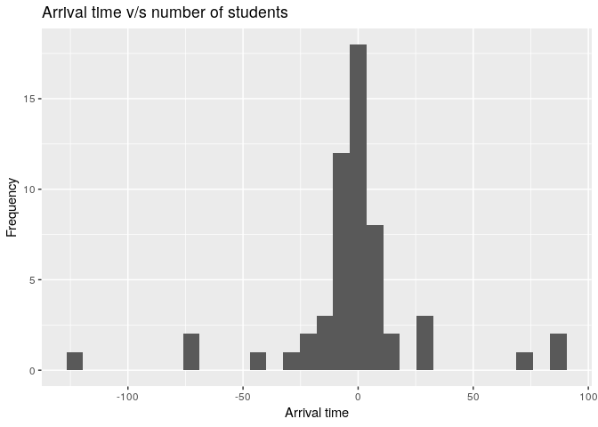
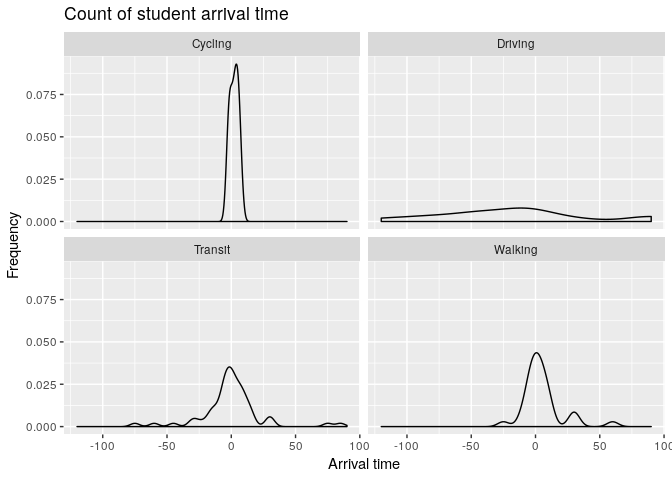
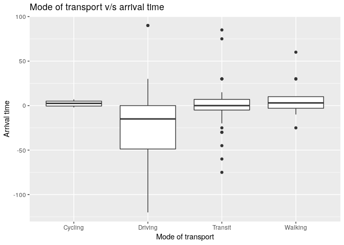
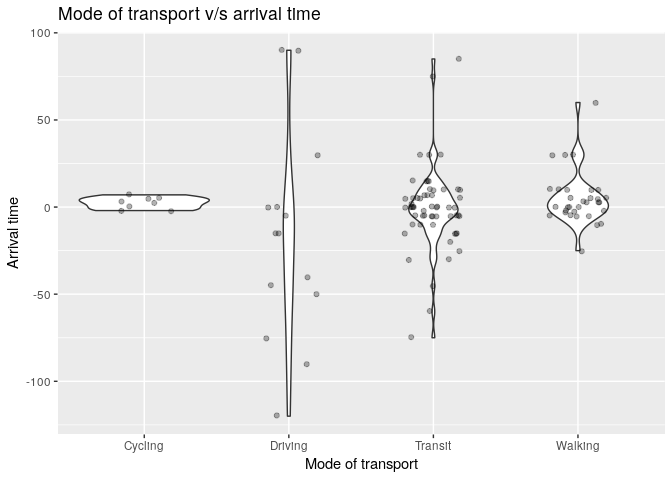

Initial Exploration of the Arrival Time Survey
================
Akansha Vashisth, Ian Flores Siaca, Rachel Riggs, Milos Milic
2019-04-06

### Survey question

**How does distance from campus influence arrival time to lectures?**

### Collected data

``` r
# Initial survey data to go here
initial_survey <- read_csv('data/Arrival_Time_April_4_2019_08_20.csv', col_type = cols())

head(initial_survey)
```

    ## # A tibble: 6 x 14
    ##   StartDate EndDate Status Progress `Duration (in s… Finished RecordedDate
    ##   <chr>     <chr>   <chr>  <chr>    <chr>            <chr>    <chr>       
    ## 1 Start Da… End Da… Respo… Progress Duration (in se… Finished Recorded Da…
    ## 2 "{\"Impo… "{\"Im… "{\"I… "{\"Imp… "{\"ImportId\":… "{\"Imp… "{\"ImportI…
    ## 3 2019-04-… 2019-0… IP Ad… 100      128              True     2019-04-03 …
    ## 4 2019-04-… 2019-0… IP Ad… 100      63               True     2019-04-03 …
    ## 5 2019-04-… 2019-0… IP Ad… 100      88               True     2019-04-03 …
    ## 6 2019-04-… 2019-0… IP Ad… 100      107              True     2019-04-03 …
    ## # … with 7 more variables: ResponseId <chr>, DistributionChannel <chr>,
    ## #   UserLanguage <chr>, Q1 <chr>, Q3 <chr>, Q4 <chr>, Q5 <chr>

### Cleaning data

``` r
clean_survey_sep_days <- initial_survey %>%
  select(contains('Q')) %>%
  slice(-c(1:2)) %>%
  rename('distance_km' = 'Q1',
         'mw_arrival' = 'Q3',
         'tt_arrival' = 'Q4',
         'mode_of_transport' = 'Q5') %>% 
  mutate(mw_arrival = hm(mw_arrival),
         mw_arrival = hour(mw_arrival)*60 + minute(mw_arrival),
         mw_arrival = if_else(mw_arrival < 400, 540 + mw_arrival, mw_arrival),
         mw_arrival = mw_arrival - 9*60) %>%
  mutate(tt_arrival = hm(tt_arrival),
         tt_arrival = hour(tt_arrival)*60 + minute(tt_arrival),
         tt_arrival = if_else(tt_arrival < 430, 570 + tt_arrival, tt_arrival),
         tt_arrival = tt_arrival - 9.5*60) %>%
  mutate(mode_of_transport = fct_recode(mode_of_transport, 
                                        driving = '1',
                                        transit = '2',
                                        walking = '3',
                                        cycling = '4')) %>%
    mutate(distance_km = as.numeric(distance_km))


clean_survey_mw <- clean_survey_sep_days %>% 
  select(-c(tt_arrival)) %>% 
  rename(arrival = mw_arrival)

clean_survey_tt <- clean_survey_sep_days %>% 
  select(-c(mw_arrival)) %>% 
  rename(arrival = tt_arrival)

clean_survey_all_days <- bind_rows(clean_survey_mw, clean_survey_tt)
```

### Cleaned data

``` r
head(clean_survey_all_days)
```

    ## # A tibble: 6 x 3
    ##   distance_km arrival mode_of_transport
    ##         <dbl>   <dbl> <fct>            
    ## 1         1.1      -5 Walking          
    ## 2         5.1     -20 Transit          
    ## 3        20       -50 Driving          
    ## 4         7.4       0 Transit          
    ## 5         1         0 Walking          
    ## 6        12.4      -2 Cycling

### Variables in the data

1.  distance\_km: Distance travelled in kilometers. This is numeric variable.
2.  mw\_arrival: Arrival time in class on Mondays and Wednesdays. This is numeric variable.
3.  tt\_arrival: Arrival time in class on Tuesdays and Thursdays. This is numeric variable.
4.  mode\_of\_transport: Mode of transportation used to travel. This is categorical variable.

### Table of Summary Statistics

#### General Summary

``` r
skim(clean_survey_sep_days) %>% 
    kable()
```

    ## Skim summary statistics  
    ##  n obs: 56    
    ##  n variables: 4    
    ## 
    ## Variable type: factor
    ## 
    ##      variable         missing    complete    n     n_unique               top_counts            
    ## -------------------  ---------  ----------  ----  ----------  ----------------------------------
    ##  mode_of_transport       0          56       56       4        Tra: 29, Wal: 16, Dri: 7, Cyc: 4 
    ## 
    ## Variable type: numeric
    ## 
    ##   variable      missing    complete    n     mean      sd       p0     p25     p50     p75     p100 
    ## -------------  ---------  ----------  ----  -------  -------  ------  ------  ------  ------  ------
    ##  distance_km       0          56       56    7.99     7.72     0.7     1.35    6.85    10.4     44  
    ##  mw_arrival        0          56       56    -0.16    26.07    -90      -5     1.5      10      90  
    ##  tt_arrival        0          56       56    -1.43    31.65    -120     -5      0       5       90

#### Grouped by Mode of Transport

``` r
clean_survey_sep_days %>%
    group_by(mode_of_transport) %>%
    skim() %>%
    kable()
```

    ## Skim summary statistics  
    ##  n obs: 56    
    ##  n variables: 4    
    ## 
    ## Variable type: numeric
    ## 
    ##  mode_of_transport     variable      n      mean      sd       p0      p25     p50     p75     p100 
    ## -------------------  -------------  ----  --------  -------  ------  -------  ------  ------  ------
    ##       Cycling         distance_km    4       6       4.73     1.5     3.08     5.05    7.97    12.4 
    ##       Cycling         mw_arrival     4      3.25     3.86      -2     1.75      4      5.5      7   
    ##       Cycling         tt_arrival     4      1.25     2.99      -2     -0.5      1      2.75     5   
    ##       Driving         distance_km    7     16.13     5.76     9.1     13.5      15     17.5    26.8 
    ##       Driving         mw_arrival     7     -11.43    59.07    -90     -47.5    -15      15      90  
    ##       Driving         tt_arrival     7     -23.57    65.94    -120    -57.5    -15     -2.5     90  
    ##       Transit         distance_km    29    10.15     7.61      2       6.6     8.1     10.1     44  
    ##       Transit         mw_arrival     29    -1.83     19.21    -60      -5       0       10      30  
    ##       Transit         tt_arrival     29     1.17     28.21    -75      -5       0       5       85  
    ##       Walking         distance_km    16     1.03     0.22     0.7     0.97      1      1.02    1.6  
    ##       Walking         mw_arrival     16     6.94     16.85    -10     -2.25     3       10      60  
    ##       Walking         tt_arrival     16     2.88     13.48    -25     -3.5     1.5     6.25     30

### Exploratory Data Analysis

``` r
### INITIAL HISTOGRAMS FOR MW & TT

clean_survey_sep_days %>% 
  ggplot(aes(x = mw_arrival)) +
  geom_histogram()
```


``` r
clean_survey_sep_days %>% 
  ggplot(aes(x = tt_arrival)) +
  geom_histogram()+
  labs(x="Arrival time", y="Frequency", title = "Arrival time v/s number of students")
```



``` r
### INITIAL SCATTERPLOTS FOR MW
clean_survey_sep_days %>% 
  ggplot(aes(x = mw_arrival, y = distance_km)) +
  geom_point()+
  labs(x="Arrival time", y="Distance(in kms)", title = "Arrival time v/s distance on Mondays and Wednesdays")
```


``` r
### FACET ON MODE OF TRANSPORT
clean_survey_sep_days %>% 
  ggplot(aes(x = mw_arrival, y = distance_km)) +
  geom_point() +
  facet_wrap(~ mode_of_transport) +
  geom_smooth(method = "lm", se = F)+
  labs(x="Arrival time", y="Distance(in kms)", title = "Arrival time v/s distance")
```


``` r
clean_survey_sep_days %>% 
  ggplot(aes(x = mw_arrival, y = distance_km)) +
  geom_point(aes(color = mode_of_transport))+
  labs(x="Arrival time", y="Distance(in kms)", title = "Arrival time v/s distance")
```


``` r
### SCATTERPLOT FOR ALL DAYS, AND FACETED

clean_survey_all_days %>% 
  ggplot(aes(x = arrival, y = distance_km)) +
  geom_point(aes(color = mode_of_transport), alpha = .5) +
  facet_wrap(~ mode_of_transport)+
  labs(x="Arrival time", y="Distance(in kms)", title = "Arrival time v/s distance")
```


``` r
### DENSITY 
clean_survey_all_days %>% 
  ggplot(aes(x = arrival)) +
  geom_density() + 
  facet_wrap(~ mode_of_transport)+
  labs(x="Arrival time", y="Frequency", title = "Count of student arrival time")
```



``` r
### BOXPLOT & VIOLIN PLOT FOR ALL DAYS

clean_survey_all_days %>% 
  ggplot(aes(x = mode_of_transport, y = arrival)) +
  geom_boxplot()+
  labs(y="Arrival time", x="Mode of transport", title = "Mode of transport v/s arrival time")
```



``` r
clean_survey_all_days %>% 
  ggplot(aes(x = mode_of_transport, y = arrival)) +
  geom_violin() +
  geom_jitter(width = .2, alpha = .3)+
  labs(y="Arrival time", x="Mode of transport", title = "Mode of transport v/s arrival time")
```



### Conclusion

(open to all) &gt; Based on the EDA
