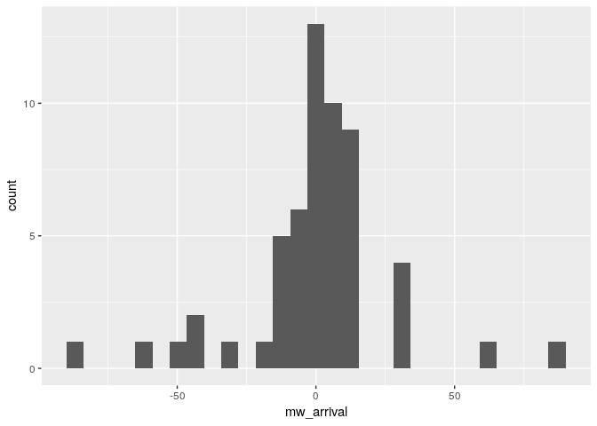
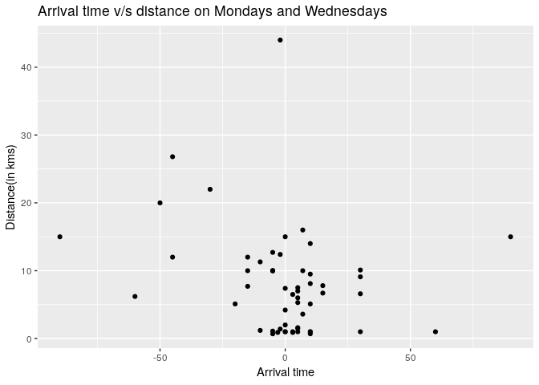
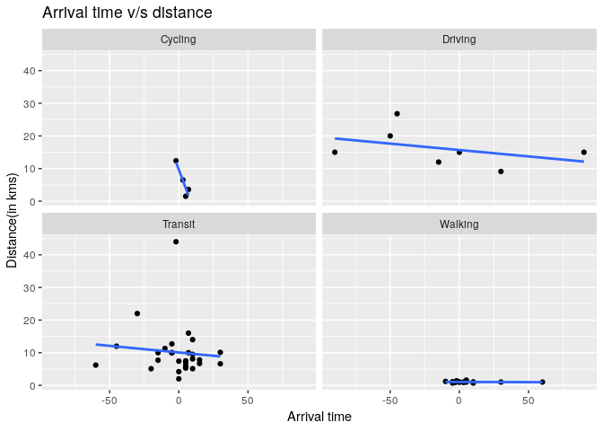
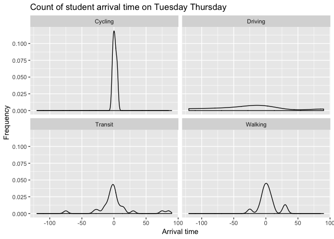
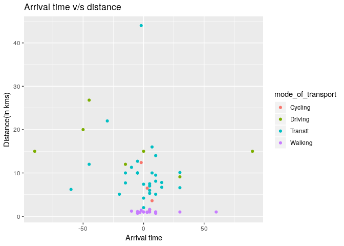
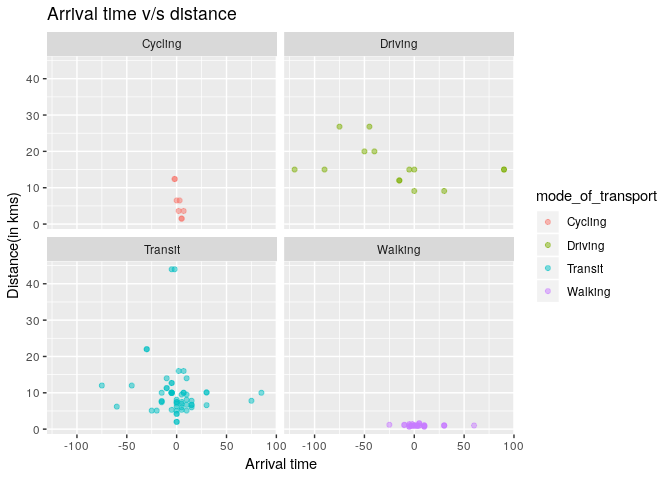

Initial Exploration of the Arrival Time Survey
================
Akansha Vashisth, Ian Flores Siaca, Rachel K. Riggs, Milos Milic
2019-04-06

### Survey question

**How does distance from campus influence arrival time to lectures?**

### Collected data

Data was collected by this [survey](https://ubc.ca1.qualtrics.com/jfe/form/SV_eo1whP0fPfWPCw5). The survey aimed to gather information on arrival time to lectures and distance lived from campus. The survey had 56 participants from the MDS students 2018-2019 cohort.

``` r
# Initial survey data
initial_survey <- read_csv('data/Arrival_Time_April_4_2019_08_20.csv', col_type = cols())

head(initial_survey)
```

    ## # A tibble: 6 x 14
    ##   StartDate EndDate Status Progress `Duration (in s… Finished RecordedDate
    ##   <chr>     <chr>   <chr>  <chr>    <chr>            <chr>    <chr>       
    ## 1 Start Da… End Da… Respo… Progress Duration (in se… Finished Recorded Da…
    ## 2 "{\"Impo… "{\"Im… "{\"I… "{\"Imp… "{\"ImportId\":… "{\"Imp… "{\"ImportI…
    ## 3 2019-04-… 2019-0… IP Ad… 100      128              True     2019-04-03 …
    ## 4 2019-04-… 2019-0… IP Ad… 100      63               True     2019-04-03 …
    ## 5 2019-04-… 2019-0… IP Ad… 100      88               True     2019-04-03 …
    ## 6 2019-04-… 2019-0… IP Ad… 100      107              True     2019-04-03 …
    ## # ... with 7 more variables: ResponseId <chr>, DistributionChannel <chr>,
    ## #   UserLanguage <chr>, Q1 <chr>, Q3 <chr>, Q4 <chr>, Q5 <chr>

### Cleaning data

``` r
clean_survey_sep_days <- initial_survey %>%
  select(contains('Q')) %>%
  slice(-c(1:2)) %>%
  rename('distance_km' = 'Q1',
         'mw_arrival' = 'Q3',
         'tt_arrival' = 'Q4',
         'mode_of_transport' = 'Q5') %>% 
  mutate(mw_arrival = hm(mw_arrival),
         mw_arrival = hour(mw_arrival)*60 + minute(mw_arrival),
         mw_arrival = if_else(mw_arrival < 400, 540 + mw_arrival, mw_arrival),
         mw_arrival = mw_arrival - 9*60) %>%
  mutate(tt_arrival = hm(tt_arrival),
         tt_arrival = hour(tt_arrival)*60 + minute(tt_arrival),
         tt_arrival = if_else(tt_arrival < 430, 570 + tt_arrival, tt_arrival),
         tt_arrival = tt_arrival - 9.5*60) %>%
  mutate(mode_of_transport = fct_recode(mode_of_transport, 
                                        driving = '1',
                                        transit = '2',
                                        walking = '3',
                                        cycling = '4')) %>%
    mutate(distance_km = as.numeric(distance_km))


clean_survey_mw <- clean_survey_sep_days %>% 
  select(-c(tt_arrival)) %>% 
  rename(arrival = mw_arrival)

clean_survey_tt <- clean_survey_sep_days %>% 
  select(-c(mw_arrival)) %>% 
  rename(arrival = tt_arrival)

clean_survey_all_days <- bind_rows(clean_survey_mw, clean_survey_tt)
```

### Cleaned data

``` r
head(clean_survey_sep_days)
```

    ## # A tibble: 6 x 4
    ##   distance_km mw_arrival tt_arrival mode_of_transport
    ##         <dbl>      <dbl>      <dbl> <fct>            
    ## 1         1.1         -5        -10 Walking          
    ## 2         5.1        -20        -25 Transit          
    ## 3        20          -50        -40 Driving          
    ## 4         7.4          0        -15 Transit          
    ## 5         1            0          0 Walking          
    ## 6        12.4         -2         -2 Cycling

``` r
head(clean_survey_all_days)
```

    ## # A tibble: 6 x 3
    ##   distance_km arrival mode_of_transport
    ##         <dbl>   <dbl> <fct>            
    ## 1         1.1      -5 Walking          
    ## 2         5.1     -20 Transit          
    ## 3        20       -50 Driving          
    ## 4         7.4       0 Transit          
    ## 5         1         0 Walking          
    ## 6        12.4      -2 Cycling

### Variables in the data

1.  distance\_km: Distance travelled in kilometers. This is a numeric variable.
2.  mw\_arrival: Arrival time in class on Mondays and Wednesdays. This is a numeric variable.
3.  tt\_arrival: Arrival time in class on Tuesdays and Thursdays. This is a numeric variable.
4.  mode\_of\_transport: Mode of transportation used to travel. This is a categorical variable.

### Table of Summary Statistics

#### General Summary

``` r
skim(clean_survey_sep_days) %>% 
    kable()
```

    ## Skim summary statistics  
    ##  n obs: 56    
    ##  n variables: 4    
    ## 
    ## Variable type: factor
    ## 
    ##      variable         missing    complete    n     n_unique               top_counts            
    ## -------------------  ---------  ----------  ----  ----------  ----------------------------------
    ##  mode_of_transport       0          56       56       4        Tra: 29, Wal: 16, Dri: 7, Cyc: 4 
    ## 
    ## Variable type: numeric
    ## 
    ##   variable      missing    complete    n     mean      sd       p0     p25     p50     p75     p100 
    ## -------------  ---------  ----------  ----  -------  -------  ------  ------  ------  ------  ------
    ##  distance_km       0          56       56    7.99     7.72     0.7     1.35    6.85    10.4     44  
    ##  mw_arrival        0          56       56    -0.16    26.07    -90      -5     1.5      10      90  
    ##  tt_arrival        0          56       56    -1.43    31.65    -120     -5      0       5       90

#### Grouped by Mode of Transport

``` r
clean_survey_sep_days %>%
    group_by(mode_of_transport) %>%
    skim() %>%
    kable()
```

    ## Skim summary statistics  
    ##  n obs: 56    
    ##  n variables: 4    
    ## 
    ## Variable type: numeric
    ## 
    ##  mode_of_transport     variable      n      mean      sd       p0      p25     p50     p75     p100 
    ## -------------------  -------------  ----  --------  -------  ------  -------  ------  ------  ------
    ##       Cycling         distance_km    4       6       4.73     1.5     3.08     5.05    7.97    12.4 
    ##       Cycling         mw_arrival     4      3.25     3.86      -2     1.75      4      5.5      7   
    ##       Cycling         tt_arrival     4      1.25     2.99      -2     -0.5      1      2.75     5   
    ##       Driving         distance_km    7     16.13     5.76     9.1     13.5      15     17.5    26.8 
    ##       Driving         mw_arrival     7     -11.43    59.07    -90     -47.5    -15      15      90  
    ##       Driving         tt_arrival     7     -23.57    65.94    -120    -57.5    -15     -2.5     90  
    ##       Transit         distance_km    29    10.15     7.61      2       6.6     8.1     10.1     44  
    ##       Transit         mw_arrival     29    -1.83     19.21    -60      -5       0       10      30  
    ##       Transit         tt_arrival     29     1.17     28.21    -75      -5       0       5       85  
    ##       Walking         distance_km    16     1.03     0.22     0.7     0.97      1      1.02    1.6  
    ##       Walking         mw_arrival     16     6.94     16.85    -10     -2.25     3       10      60  
    ##       Walking         tt_arrival     16     2.88     13.48    -25     -3.5     1.5     6.25     30

### Exploratory Data Analysis

To start the EDA, we wanted to see what is the usual mode of transport of MDS students.

``` r
clean_survey_sep_days %>%
  ggplot() +
  geom_bar(aes(x=mode_of_transport)) +
  labs(y= "Frequency", x = "Mode of transport", title = "Number of MDS Students using different modes of transport") 
```



Comparing different modes of transport:

1.  The students who choose to cycle to lectures are the least.

2.  The number of students who drive to lectures is also less.

3.  The maximum number of students use transit.

4.  Many students choose to walk to the lectures but not as much as the ones who take transit.

Examining if there is any connection with the distance where the students live with an approximate arrival time of students in lecture.

``` r
### scatterplot for all days grouped together, faceted by mode of transport
clean_survey_sep_days %>% 
  ggplot(aes(x = mw_arrival, y = distance_km)) +
  geom_point() +
  facet_wrap(~ mode_of_transport) +
  labs(x="Arrival time", y="Distance(in kms)", title = "Arrival time v/s distance")
```



Looking at this graph, we think mode of travel and the distance affects the arrival time to lectures.

Comparing different modes of transport with distance:

1.  Cyclists are very close to on time and live within 10 kilometers.

2.  Students who drive have a wide range of arrival time, starting from a few early arrivals to the one student who enters the class at last. Nobody who drives lives within 10kms (except 1 who lives 10 km away).

3.  Students who use transit are more and they arrive within +/- 30 minutes of the lecture. Students who use transit have a wide range of distance starting from 2kms to 20kms(except 2 outliers).

4.  The students who walk mostly arrive within +/- 10 minutes of the lecture (other than 2 outliers). They all live on-campus or very close to campus within 2-3 km.

Examining the arrival time on different days, on Monday and Wednesday when the lecture starts at 09:00 and on Tuesday and Thursday when the lecture starts at 09:30.

``` r
### put plots for MW and TT here
clean_survey_sep_days %>% 
  ggplot(aes(x = mw_arrival)) +
  geom_density() + 
  facet_wrap(~ mode_of_transport)+
  labs(x="Arrival time", y="Frequency", title = "Count of student arrival time on Monday Wednesday")
```



``` r
clean_survey_sep_days %>% 
  ggplot(aes(x = tt_arrival)) +
  geom_density() + 
  facet_wrap(~ mode_of_transport)+
  labs(x="Arrival time", y="Frequency", title = "Count of student arrival time on Tuesday Thursday")
```



It is interesting that there is a slight difference in arrival time when the lectures start at 09:30 compared when the lecture starts at 09:30.

Examining the combined arrival time on all days with different modes of transportation:

``` r
### density plot for all days, faceted by mode of transport
clean_survey_all_days %>% 
  ggplot(aes(x = arrival)) +
  geom_density() + 
  facet_wrap(~ mode_of_transport)+
  labs(x="Arrival time", y="Frequency", title = "Count of student arrival time")
```



Let's check mode of transportation and arrival time of all the students:

``` r
### violin plot for all days, faceted by mode of transport
clean_survey_all_days %>% 
  ggplot(aes(x = mode_of_transport, y = arrival)) +
  geom_violin() +
  geom_jitter(width = .2, alpha = .3)+
  labs(y="Arrival time", x="Mode of transport", title = "Mode of transport v/s arrival time")
```



In terms of the mode of transport and arrival time, a very small number of students who cycle and all arrive on time. The ones who choose to drive are less in number and none of them arrive exactly on time, all of them either arrive early or late. Otherwise, among transit and walking (these two are the most popular mode of transports), students arrive on time, early and late in a mixed fashion.

### Conclusion

(open to all) &gt; Based on the EDA, we think there is some relation between distance and arrival time of all the students. To investigate this we will fit a linear regression using the distance as the predictor variable and the arrival time as the response variable. We would also like to find out if the mode of transportation affects the arrival time.
