Survey Analysis Arrival Time
================
Akansha Vashisth, Ian Flores Siaca, Rachel K. Riggs, Milos Milic
2019-04-13

Libraries
---------

``` r
library(tidyverse)
library(tidybayes)
library(brms)
library(broom)
library(knitr)
library(gridExtra)
```

Load the data
-------------

``` r
clean_survey_all_days <- read_csv('https://raw.githubusercontent.com/UBC-MDS/survey_arrival_time/master/data/clean_survey_responses_all_days.csv')
clean_survey_sep_days <- read_csv('https://raw.githubusercontent.com/UBC-MDS/survey_arrival_time/master/data/clean_survey_responses_sep_days.csv')
```

Survey question
===============

**How does distance from campus influence arrival time to lectures?**

We conducted an observational study to explore if there is a relationship between the distance lived from class and arrival time. We also wanted to test a potential confounder for this relationship which is the mode of transportation a student takes to class.

Methods
=======

Survey study design
-------------------

We asked our survey respondents to answer the following questions:

-   How far from Hugh Dempster do you live in kilometers via the mode of transport you use(a google maps link was provided to help with the distance estimation)?

-   What time do you typically arrive at Hugh Dempster on Mondays and Wednesdays? please enter in the format hh:mm

-   What time do you typically arrive at Hugh Dempster on Mondays and Wednesdays? please enter in the format hh:mm

-   What is your typical mode of transit? (drive, public transit, walk, or bike)

Data collection methods
-----------------------

Data was collected by this [survey](https://ubc.ca1.qualtrics.com/jfe/form/SV_eo1whP0fPfWPCw5) hosted by Qualtrics. The survey had 56 participants from the MDS students 2018-2019 cohort and responses were anonymized.

Analysis methods
----------------

We performed initial [exploratory data analysis](https://github.com/UBC-MDS/survey_arrival_time/blob/v2.0/milestone2.md) on our data.

To analyze the data, we consider 3 groups:

-   All days grouped together

-   Mondays and Wednesdays together

-   Tuesdays and Thursdays together

Below we fit a linear regression using the distance as the predictor variable and the arrival time as the response variable. We compare this linear regression model with a null model through an ANOVA test. To validate the estimates of the frequentist approach, given the possibility of a small sample size, we use a Bayesian linear regression. After this, we will move on to using the mode of transportation as a confounder variable and fit a linear regression model with these variables. We will compare this model with the null model through an ANOVA test, and again validate using a Bayesian linear regression.

EDA
===

``` r
plot1 <- clean_survey_all_days %>%
  ggplot(height = 17 , width = 2) +
  geom_histogram(aes(x=distance_km)) + 
  theme(axis.title=element_text(size=10),
        plot.title = element_text(size = 10, face = "bold")) +  
  labs(y= "Frequency", x = "Distance (in km)", title = "Distribution of Distance Lived From Campus (km)") 

plot2 <- clean_survey_all_days %>%
  ggplot() +
  geom_histogram(aes(x=arrival)) +  
  theme(axis.title=element_text(size=10),
        plot.title = element_text(size = 10, face = "bold")) +  
  labs(y= "Frequency", x = "Arrival time", title = "Distribution of Arrival Time (minutes)") 

grid.arrange(plot1, plot2, ncol=2)
```

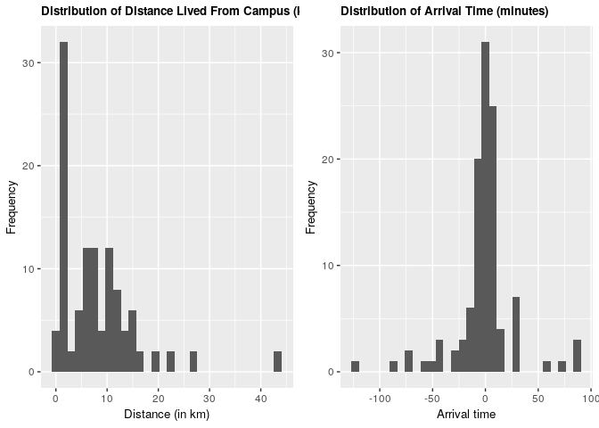

We can see that the majority of students live within 15 kilometers of campus, and that the majority arrive within 30 mintues before and 30 minutes after the start of the lecture.

``` r
plot3 <- clean_survey_all_days %>%
  ggplot() +
  geom_bar(aes(x=mode_of_transport)) +
  theme(axis.title=element_text(size=10),
        plot.title = element_text(size = 10, face = "bold")) +  
  labs(y= "Frequency", x = "Mode of transport", title = "Number of MDS Students using different modes of transport") 
plot3
```


Comparing modes of transit, we see that transit is the most common form of transportation, while cycling is the least.

Does there appear to be a relationship between arrival time and distance lived from campus? An intial plot shows us:

``` r
plot4 <- clean_survey_all_days %>%
  ggplot(aes(x = arrival, y = distance_km)) +
  geom_point() +
  theme(axis.title=element_text(size=10),
        plot.title = element_text(size = 10, face = "bold")) +  
  labs(x = "Arrival time (minutes)", y = "Distance (km)", title = "Arrival Time vs Distance Lived From Campus") 
plot4
```

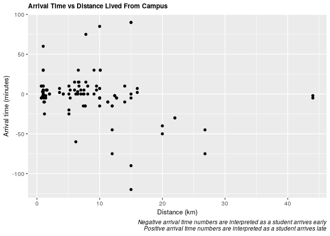

It's difficult to discern from this plot so we will further explore this question in the analysis below.

``` r
plot5 <- clean_survey_sep_days %>% 
  ggplot(aes(x = mw_arrival)) +
  geom_density(aes(fill = "salmon", color = "salmon"), alpha = .3) + 
  geom_density(aes(x = tt_arrival, fill = "#00BFC4", color = "#00BFC4"), alpha = .3) +
  facet_wrap(~ mode_of_transport) +
  theme(axis.title=element_text(size=10),
        plot.title = element_text(size = 10, face = "bold")) +
  labs(x="Arrival time", y="Frequency", title = "Density of student arrival time on Mon & Wed vs Tues & Thurs") +
  guides(color = FALSE) +
  scale_fill_identity(name = "days",
                       breaks = c("salmon", "#00BFC4"),
                       labels = c("Mon-Wed", "Tues-Thurs"),
                       guide = "legend")
plot5
```

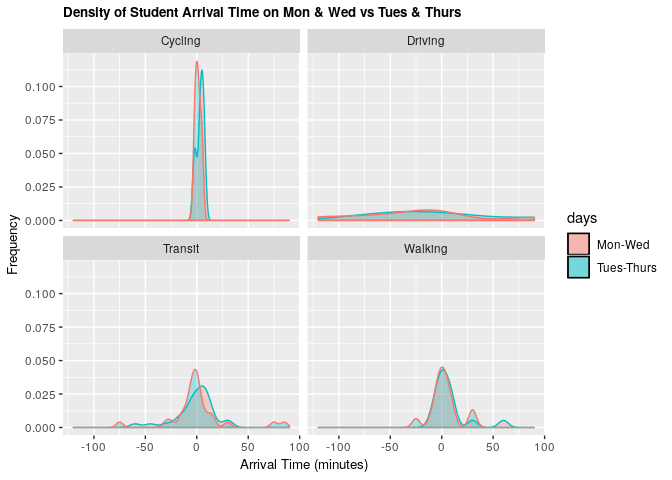

Comparing this distribution of arrival times on Mondays and Wednesday vs Tuesdays and Thursdays reveals that there is only a slight difference in arrival time when the lectures start at 09:00 compared when the lecture starts at 09:30. It is most noticeable for students taking transit.

Analysis and results
====================

Without Confounders
-------------------

### Distance and Arrival Time (Overall)

``` r
# Frequentist
fit_all <- lm(arrival ~ distance_km, data = clean_survey_all_days)

tidy(fit_all) %>% 
    bind_cols(confint_tidy(fit_all, conf.level = 0.95)) %>%
    select(term, estimate, conf.low, conf.high, p.value) %>%
    kable()
```

| term         |    estimate|    conf.low|   conf.high|    p.value|
|:-------------|-----------:|-----------:|-----------:|----------:|
| (Intercept)  |   6.7567108|  -0.8459198|  14.3593413|  0.0809729|
| distance\_km |  -0.9445517|  -1.6316222|  -0.2574813|  0.0074945|

``` r
ggplot(clean_survey_all_days, aes(x = distance_km, y = arrival)) + 
  geom_point() +
  xlab("Arrival time") +
  ylab("Distance") +
  ggtitle("Distance vs arrival time plot") +
  stat_smooth(method = "lm", 
              col = "red")
```

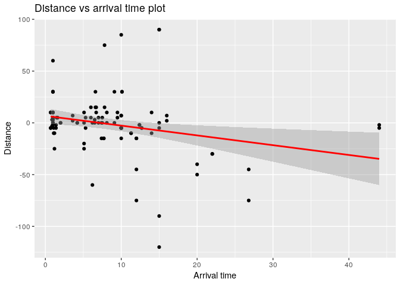

``` r
# Returns the 95% estimates
fit_all_bayes %>%
    gather_draws(b_Intercept, b_distance_km) %>%
    median_qi() %>%
    select(.variable, .value, .lower, .upper) %>%
    kable()
```

| .variable       |      .value|      .lower|      .upper|
|:----------------|-----------:|-----------:|-----------:|
| b\_distance\_km |  -0.9496094|  -1.6308757|  -0.2803076|
| b\_Intercept    |   6.8919287|  -0.4078537|  14.1205474|

``` r
#Plots the Baysean model
fit_all_bayes %>%
    gather_draws(b_Intercept, b_distance_km) %>%
    ggplot(aes(.value)) +
    geom_density() +
    facet_wrap(~ .variable, scales = 'free') +
    labs(x = 'Value',
         title = 'Bayesian All Days Model')
```

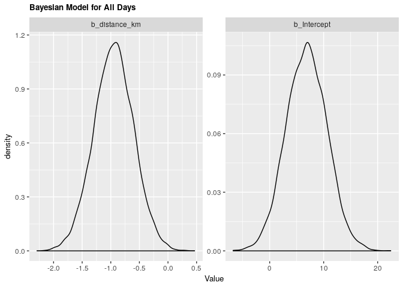

As per both frequentist and bayesian approach there is an association between distance and arrival time. For the frequentist approach the estimate is of -0.945 with a confidence interval of 95% (-1.604, -0.257). For the Bayesian approach the estimate is -0.949 with credible interval of 95% (-1.639, -0.267).

For every increase of 1 km lived from campus, the expected change in arrival time is early by almost 1 minute.

### Distance and Arrival Time (Monday & Wednesday)

``` r
fit_mw <- lm(mw_arrival ~ distance_km, data = clean_survey_sep_days)

tidy(fit_mw) %>% 
    bind_cols(confint_tidy(fit_mw, conf.level = 0.95)) %>%
    select(term, estimate, conf.low, conf.high, p.value) %>%
    kable()
```

| term         |    estimate|   conf.low|   conf.high|    p.value|
|:-------------|-----------:|----------:|-----------:|----------:|
| (Intercept)  |   6.8203611|  -3.030243|  16.6709649|  0.1707956|
| distance\_km |  -0.8732192|  -1.763445|   0.0170068|  0.0543802|

``` r
ggplot(clean_survey_sep_days, aes(x = distance_km, y = mw_arrival)) + 
  geom_point() +
  ylab("Arrival Time") +
  xlab("Distance") +
  ggtitle("Mondays' and Wednesdays' Model") +
  stat_smooth(method = "lm", col = "red")
```


``` r
fit_mw_bayes %>%
    gather_draws(b_Intercept, b_distance_km) %>%
    median_qi() %>%
    select(.variable, .value, .lower, .upper) %>%
    kable()
```

| .variable       |      .value|     .lower|      .upper|
|:----------------|-----------:|----------:|-----------:|
| b\_distance\_km |  -0.8735195|  -1.743011|  -0.0067567|
| b\_Intercept    |   7.2024136|  -2.265611|  16.5400766|

``` r
fit_mw_bayes %>%
    gather_draws(b_Intercept, b_distance_km) %>%
    ggplot(aes(.value)) +
    geom_density() +
    facet_wrap(~ .variable, scales = 'free') +
    labs(x = 'Value',
         title = 'Bayesian Monday & Wednesday Model')
```

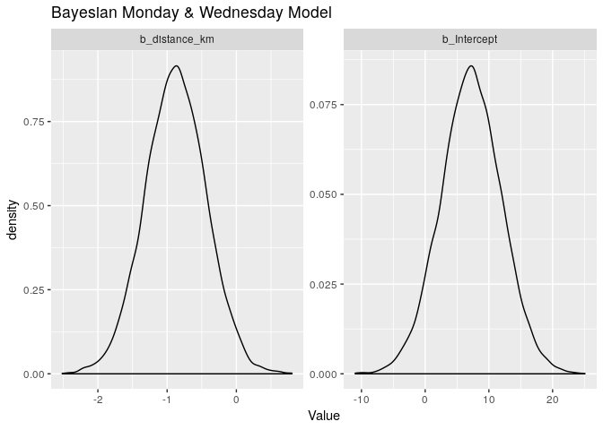

As per both frequentist and bayesian approach there is an association between distance and arrival time for Mondays and Wednesdays. For the frequentist approach the estimate is of -0.87 with a confidence interval of 95% (-1.76, 0.01). For the Bayesian approach the estimate is -0.87 with credible interval of 95% (-1.75, 0.01).

### Distance and Arrival Time (Tuesday and Thursdays)

``` r
fit_tt <- lm(tt_arrival ~ distance_km, data = clean_survey_sep_days)

tidy(fit_tt) %>% 
    bind_cols(confint_tidy(fit_tt, conf.level = 0.95)) %>%
    select(term, estimate, conf.low, conf.high, p.value) %>%
    kable()
```

| term         |   estimate|   conf.low|   conf.high|    p.value|
|:-------------|----------:|----------:|-----------:|----------:|
| (Intercept)  |   6.693060|  -5.296692|  18.6828132|  0.2680140|
| distance\_km |  -1.015884|  -2.099431|   0.0676624|  0.0655509|

``` r
ggplot(clean_survey_sep_days, aes(x = distance_km, y = tt_arrival)) + 
  geom_point() +
  ylab("Arrival Time") +
  xlab("Distance") +
  ggtitle("Tuesdays' and Thursdays' Model") +
  stat_smooth(method = "lm", col = "red")
```

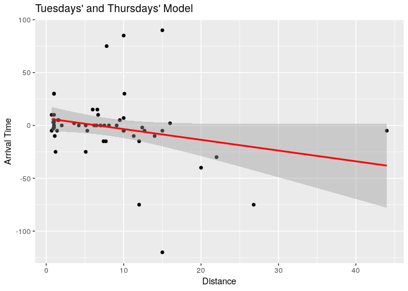

``` r
fit_tt_bayes %>%
    gather_draws(b_Intercept, b_distance_km) %>%
    median_qi() %>%
    select(.variable, .value, .lower, .upper) %>%
    kable()
```

| .variable       |     .value|     .lower|      .upper|
|:----------------|----------:|----------:|-----------:|
| b\_distance\_km |  -1.009309|  -2.109241|   0.0423174|
| b\_Intercept    |   6.962348|  -4.184954|  18.3208226|

``` r
# Plots the Bayes Model
fit_tt_bayes %>%
    gather_draws(b_Intercept, b_distance_km) %>%
    ggplot(aes(.value)) +
    geom_density() +
    facet_wrap(~ .variable, scales = 'free') +
    labs(x = 'Value',
         title = 'Bayesian Tuesday & Thursday Model')
```

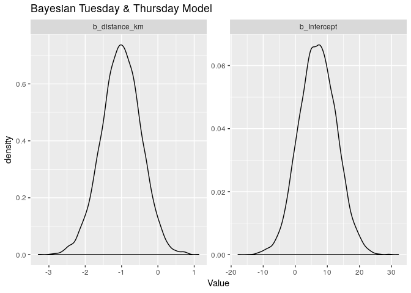

As per both frequentist and bayesian approach there is an association between distance and arrival time for Tuesdays and Thursdays. For the frequentist approach the estimate is of -1.02 with a confidence interval of 95% (-2.1, 0.0677). For the Bayesian approach the estimate is -1.02 with credible interval of 95% (-2.05, 0.02).

With Confounders
----------------

### Distance and Arrival Time (Overall)

``` r
fit_all_transp <- lm(arrival ~ distance_km + mode_of_transport, data = clean_survey_all_days)
```

``` r
ggplot(clean_survey_all_days, aes(x = distance_km, y = arrival)) + 
    geom_point() +
    ylab("Arrival Time") +
    xlab("Distance") +
    ggtitle("Mondays' and Wednesdays' Model") +
    facet_wrap(~ mode_of_transport, nrow = 4) +
    geom_smooth(method = 'lm', col = 'red')
```

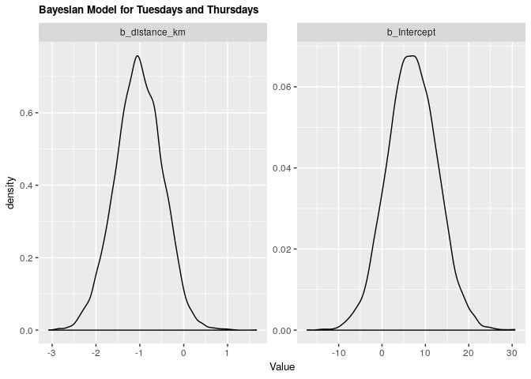

``` r
fit_all_bayes_transp%>%
    gather_draws(b_Intercept, b_distance_km, b_mode_of_transportDriving, b_mode_of_transportTransit, b_mode_of_transportWalking) %>%
    ggplot(aes(.value)) +
    geom_density() +
    facet_wrap(~ .variable, scales = 'free') +
    labs(x = 'Value',
         title = 'Bayesian All Days Model w Confounder')
```

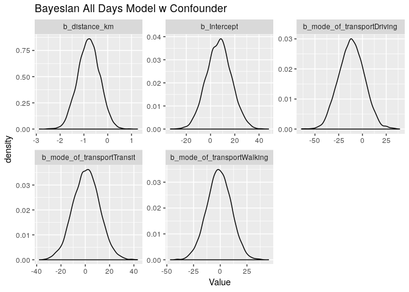

As per both frequentist and bayesian approach there is an association between distance and arrival time when including confounders. We can compare the two estimates in the tables below:

#### Frequentist

``` r
tidy(fit_all_transp) %>% 
    bind_cols(confint_tidy(fit_all_transp, conf.level = 0.95)) %>%
    select(term, estimate, conf.low, conf.high, p.value) %>%
    kable()
```

| term                       |     estimate|    conf.low|   conf.high|    p.value|
|:---------------------------|------------:|-----------:|-----------:|----------:|
| (Intercept)                |    7.0621190|  -13.438025|  27.5622628|  0.4961374|
| distance\_km               |   -0.8020198|   -1.711544|   0.1075044|  0.0833205|
| mode\_of\_transportDriving |  -11.6266849|  -38.055241|  14.8018711|  0.3851024|
| mode\_of\_transportTransit |    0.7494133|  -20.664819|  22.1636458|  0.9448202|
| mode\_of\_transportWalking |   -1.3287860|  -23.879118|  21.2215461|  0.9072275|

#### Bayesian

``` r
fit_all_bayes_transp  %>%
    gather_draws(b_Intercept, b_distance_km, b_mode_of_transportDriving, b_mode_of_transportTransit, b_mode_of_transportWalking) %>%
    median_qi() %>%
    select(.variable, .value, .lower, .upper) %>%
    kable()
```

| .variable                     |       .value|      .lower|      .upper|
|:------------------------------|------------:|-----------:|-----------:|
| b\_distance\_km               |   -0.7951349|   -1.685033|   0.0898348|
| b\_Intercept                  |    7.0404370|  -13.132619|  27.3133412|
| b\_mode\_of\_transportDriving |  -11.5763177|  -36.882394|  14.7199021|
| b\_mode\_of\_transportTransit |    0.8703255|  -20.589510|  22.2523980|
| b\_mode\_of\_transportWalking |   -1.1121186|  -23.579275|  20.9849034|

### Distance and Arrival Time (Monday & Wednesday)

``` r
fit_mw_transp <- lm(mw_arrival ~ distance_km + mode_of_transport, data = clean_survey_sep_days)
```

``` r
ggplot(clean_survey_sep_days, aes(x = distance_km, y = mw_arrival)) + 
    geom_point() +
    ylab("Arrival Time") +
    xlab("Distance") +
    ggtitle("Mondays' and Wednesdays' Model") +
    facet_wrap(~ mode_of_transport, nrow = 4) +
    geom_smooth(method = 'lm', col = 'red')
```

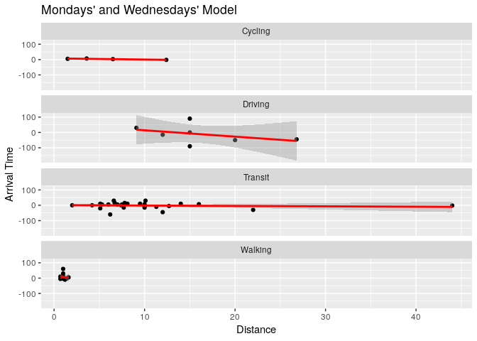

``` r
fit_mw_bayes_transp %>%
    gather_draws(b_Intercept, b_distance_km, b_mode_of_transportDriving, 
                 b_mode_of_transportTransit, b_mode_of_transportWalking) %>%
    median_qi() %>%
    kable()
```

| .variable                     |      .value|      .lower|      .upper|  .width| .point | .interval |
|:------------------------------|-----------:|-----------:|-----------:|-------:|:-------|:----------|
| b\_distance\_km               |  -0.6933251|   -1.869871|   0.5048074|    0.95| median | qi        |
| b\_Intercept                  |   7.4879088|  -19.518949|  34.8866899|    0.95| median | qi        |
| b\_mode\_of\_transportDriving |  -7.2091221|  -42.006823|  27.1526442|    0.95| median | qi        |
| b\_mode\_of\_transportTransit |  -1.8593489|  -30.316003|  26.3299303|    0.95| median | qi        |
| b\_mode\_of\_transportWalking |   0.4209510|  -29.496710|  30.1349836|    0.95| median | qi        |

``` r
fit_mw_bayes_transp %>%
    gather_draws(b_Intercept, b_distance_km, b_mode_of_transportDriving, 
                 b_mode_of_transportTransit, b_mode_of_transportWalking) %>%
    ggplot(aes(.value)) +
    geom_density() +
    facet_wrap(~ .variable, scales = 'free') +
    labs(x = 'Value',
         title = 'Bayesian Monday & Wednesday Model w Confounder')
```

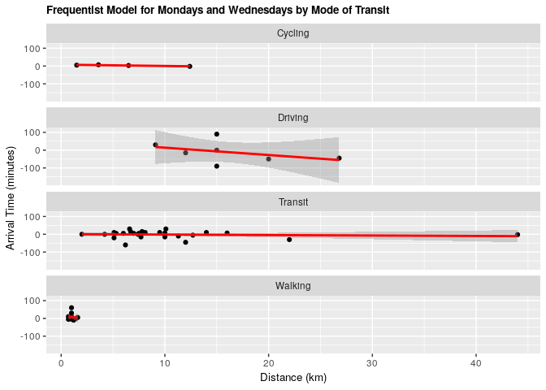

As per both frequentist and bayesian approach there is an association between distance and arrival time for Monday & Wednesday when including confounders. We can compare the two estimates in the tables below:

#### Frequentist

``` r
tidy(fit_mw_transp)%>% 
    bind_cols(confint_tidy(fit_mw_transp, conf.level = 0.95)) %>%
    select(term, estimate, conf.low, conf.high, p.value) %>%
    kable()
```

| term                       |    estimate|    conf.low|   conf.high|    p.value|
|:---------------------------|-----------:|-----------:|-----------:|----------:|
| (Intercept)                |   7.3754923|  -19.779601|  34.5305861|  0.5879432|
| distance\_km               |  -0.6875821|   -1.892365|   0.5172004|  0.2572468|
| mode\_of\_transportDriving |  -7.7143475|  -42.722391|  27.2936955|  0.6600777|
| mode\_of\_transportTransit |  -2.2253062|  -30.591229|  26.1406164|  0.8754767|
| mode\_of\_transportWalking |   0.2710767|  -29.599757|  30.1419103|  0.9855354|

#### Bayesian

``` r
fit_mw_bayes_transp %>%
    gather_draws(b_Intercept, b_distance_km, b_mode_of_transportDriving, 
                 b_mode_of_transportTransit, b_mode_of_transportWalking) %>%
    median_qi() %>%
    kable()
```

| .variable                     |      .value|      .lower|      .upper|  .width| .point | .interval |
|:------------------------------|-----------:|-----------:|-----------:|-------:|:-------|:----------|
| b\_distance\_km               |  -0.6933251|   -1.869871|   0.5048074|    0.95| median | qi        |
| b\_Intercept                  |   7.4879088|  -19.518949|  34.8866899|    0.95| median | qi        |
| b\_mode\_of\_transportDriving |  -7.2091221|  -42.006823|  27.1526442|    0.95| median | qi        |
| b\_mode\_of\_transportTransit |  -1.8593489|  -30.316003|  26.3299303|    0.95| median | qi        |
| b\_mode\_of\_transportWalking |   0.4209510|  -29.496710|  30.1349836|    0.95| median | qi        |

### Distance and Arrival Time (Tuesday and Thursdays)

``` r
fit_tt_transp <- lm(tt_arrival ~ distance_km + mode_of_transport, data = clean_survey_sep_days)
```

``` r
ggplot(clean_survey_sep_days, aes(x = distance_km, y = tt_arrival)) + 
    geom_point() +
    ylab("Arrival Time") +
    xlab("Distance") +
    ggtitle("Tuesdays' and Thursdays' Model") +
    facet_wrap(~ mode_of_transport, nrow = 4) +
    geom_smooth(method = 'lm', col = 'red')
```

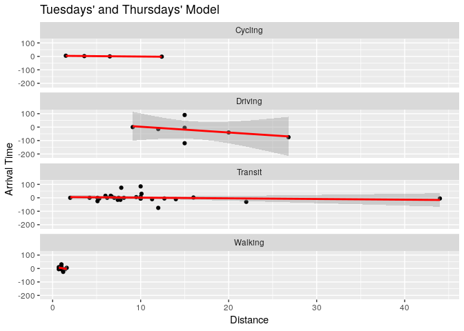

``` r
fit_tt_bayes_transp %>%
    gather_draws(b_Intercept, b_distance_km, b_mode_of_transportDriving, b_mode_of_transportTransit, b_mode_of_transportWalking) %>%
    ggplot(aes(.value)) +
    geom_density() +
    facet_wrap(~ .variable, scales = 'free') +
    labs(x = 'Value',
         title = 'Bayesian Tuesday & Thursday Model w Confounder')
```

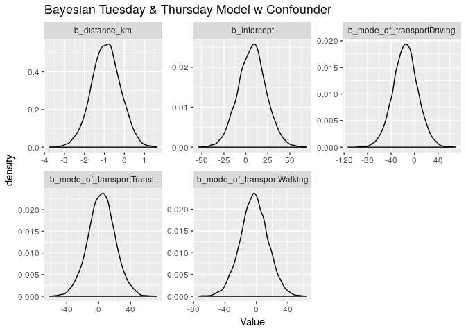

As per both frequentist and bayesian approach there is an association between distance and arrival time for Tuesdays and Thursdays when including confounders. We can compare the two estimates in the tables below:

#### Frequentist

``` r
tidy(fit_tt_transp)%>% 
    bind_cols(confint_tidy(fit_tt_transp, conf.level = 0.95)) %>%
    select(term, estimate, conf.low, conf.high, p.value) %>%
    kable()
```

| term                       |     estimate|    conf.low|  conf.high|    p.value|
|:---------------------------|------------:|-----------:|----------:|----------:|
| (Intercept)                |    6.7487456|  -25.706900|  39.204391|  0.6781001|
| distance\_km               |   -0.9164576|   -2.356408|   0.523493|  0.2071309|
| mode\_of\_transportDriving |  -15.5390222|  -57.380478|  26.302433|  0.4593476|
| mode\_of\_transportTransit |    3.7241328|  -30.178690|  37.626956|  0.8263407|
| mode\_of\_transportWalking |   -2.9286487|  -38.630135|  32.772837|  0.8698427|

#### Bayesian

``` r
fit_tt_bayes_transp %>%
    gather_draws(b_Intercept, b_distance_km, b_mode_of_transportDriving, 
                 b_mode_of_transportTransit, b_mode_of_transportWalking) %>%
    median_qi() %>%
    kable()
```

| .variable                     |      .value|      .lower|      .upper|  .width| .point | .interval |
|:------------------------------|-----------:|-----------:|-----------:|-------:|:-------|:----------|
| b\_distance\_km               |   -0.921035|   -2.368708|   0.4951602|    0.95| median | qi        |
| b\_Intercept                  |    7.333948|  -24.250465|  38.9872401|    0.95| median | qi        |
| b\_mode\_of\_transportDriving |  -15.497870|  -57.356244|  26.3809433|    0.95| median | qi        |
| b\_mode\_of\_transportTransit |    3.858318|  -30.239883|  37.9198987|    0.95| median | qi        |
| b\_mode\_of\_transportWalking |   -3.014571|  -38.038679|  31.7692654|    0.95| median | qi        |

Discussion of the results
=========================

From our results we can see that there is a relationship between how far someone lives from campus and their arrival time. This was found overall and for the two groups of days (Mondays-Wednesdays, Tuesdays-Thursdays). Given the consistency between methods in both the estimates achieved and the confidence/credible intervals allows us to infer that there is an association between how far someone lives from campus and their time of arrival. This picture changed when including mode of transport as our confounder in the analysis. When doing this component, we could observe that mode of transport doesn't have an effect as a confounder as our estimates didn't change to be outside of the confidence/credible intervals of the first estimates. This phenomena remained both for the overall analysis and for the focused analysis in the groups of days.

Discussion of the survey/study design
=====================================
