Survey Analysis Arrival Time
================
Akansha Vashisth, Ian Flores Siaca, Rachel K. Riggs, Milos Milic
2019-04-13

## Libraries

``` r
library(tidyverse)
library(tidybayes)
library(brms)
library(broom)
library(knitr)
library(gridExtra)
```

## Load the data

``` r
clean_survey_all_days <- read_csv('https://raw.githubusercontent.com/UBC-MDS/survey_arrival_time/master/data/clean_survey_responses_all_days.csv')
clean_survey_sep_days <- read_csv('https://raw.githubusercontent.com/UBC-MDS/survey_arrival_time/master/data/clean_survey_responses_sep_days.csv')
```

# Survey question

**How does distance from campus influence arrival time to lectures?**

We conducted an observational study to explore if there is a
relationship between the distance lived from class and arrival time. We
also wanted to test a potential confounder for this relationship which
is the mode of transportation a student takes to class.

# Methods

## Survey study design

We asked our survey respondents to answer the following questions:

  - How far from Hugh Dempster do you live in kilometers via the mode of
    transport you use(a google maps link was provided to help with the
    distance estimation)?

  - What time do you typically arrive at Hugh Dempster on Mondays and
    Wednesdays? please enter in the format hh:mm

  - What time do you typically arrive at Hugh Dempster on Mondays and
    Wednesdays? please enter in the format hh:mm

  - What is your typical mode of transit? (drive, public transit, walk,
    or bike)

## Data collection methods

Data was collected by this
[survey](https://ubc.ca1.qualtrics.com/jfe/form/SV_eo1whP0fPfWPCw5)
hosted by Qualtrics. The survey had 56 participants from the MDS
students 2018-2019 cohort and responses were anonymized.

## Analysis methods

We performed initial [exploratory data
analysis](https://github.com/UBC-MDS/survey_arrival_time/blob/v2.0/milestone2.md)
on our data.

To analyze the data, we consider 3 groups:

  - All days grouped together

  - Mondays and Wednesdays together

  - Tuesdays and Thursdays together

Below we fit a linear regression using the distance as the predictor
variable and the arrival time as the response variable. We compare this
linear regression model with a null model through an ANOVA test. To
validate the estimates of the frequentist approach, given the
possibility of a small sample size, we use a Bayesian linear regression.
After this, we will move on to using the mode of transportation as a
confounder variable and fit a linear regression model with these
variables. We will compare this model with the null model through an
ANOVA test, and again validate using a Bayesian linear regression.

# EDA

``` r
plot1 <- clean_survey_all_days %>%
  ggplot() +
  geom_histogram(aes(x=distance_km)) + 
  theme(axis.title=element_text(size=10),
        plot.title = element_text(size = 10, face = "bold")) +  
  labs(y= "Frequency", x = "Distance (km)", title = "Distribution of Distance Lived From Campus (km)") 

plot2 <- clean_survey_all_days %>%
  ggplot() +
  geom_histogram(aes(x=arrival)) +  
  theme(axis.title=element_text(size=10),
        plot.title = element_text(size = 10, face = "bold")) +  
  labs(y= "Frequency", x = "Arrival time (minutes)", title = "Distribution of Arrival Time (minutes)") 

grid.arrange(plot1, plot2, ncol=2)
```

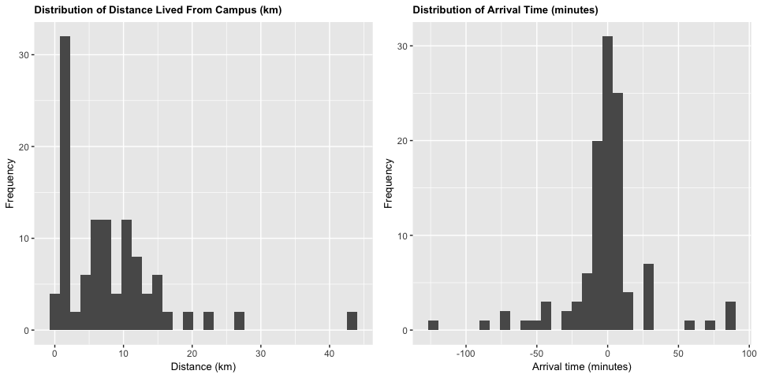<!-- -->

We can see that the majority of students live within 15 kilometers of
campus, and that the majority arrive within 30 minutes before and 30
minutes after the start of the lecture.

``` r
plot3 <- clean_survey_all_days %>%
  ggplot() +
  geom_bar(aes(x=mode_of_transport)) +
  theme(axis.title=element_text(size=10),
        plot.title = element_text(size = 10, face = "bold")) +  
  labs(y= "Frequency", x = "Mode of transport", 
       title = "Number of MDS Students Using Different Modes of Transport") 
plot3
```

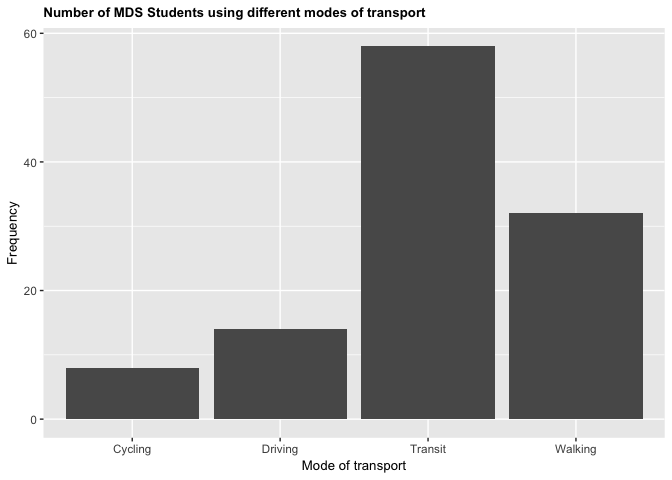<!-- -->

Comparing modes of transport, we see that public transit is the most
common form of transportation, while cycling is the least.

Does there appear to be a relationship between arrival time and distance
lived from campus? An initial plot shows us:

``` r
plot4 <- clean_survey_all_days %>%
  ggplot(aes(x = distance_km, y = arrival)) +
  geom_point() +
  theme(axis.title=element_text(size=10),
        plot.title = element_text(size = 10, face = "bold")) +  
  labs(x = "Distance (km)", y = "Arrival time (minutes)", 
       title = "Arrival Time vs Distance Lived From Campus",
       caption = "Negative arrival time numbers are interpreted as a student arrives early\nPositive arrival time numbers are interpreted as a student arrives late") +
  theme(plot.caption = element_text(face = "italic"))
plot4
```

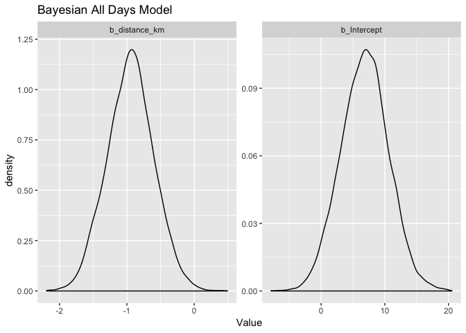<!-- -->

It’s difficult to discern from this plot so we will further explore this
question in the analysis below.

``` r
plot5 <- clean_survey_sep_days %>% 
  ggplot(aes(x = mw_arrival)) +
  geom_density(aes(fill = "salmon", color = "salmon"), alpha = .3) + 
  geom_density(aes(x = tt_arrival, fill = "#00BFC4", color = "#00BFC4"), alpha = .3) +
  facet_wrap(~ mode_of_transport) +
  theme(axis.title=element_text(size=10),
        plot.title = element_text(size = 10, face = "bold")) +
  labs(x="Arrival Time (minutes)", y="Frequency", title = "Density of Student Arrival Time on Mon & Wed vs Tues & Thurs") +
  guides(color = FALSE) +
  scale_fill_identity(name = "days",
                      breaks = c("salmon", "#00BFC4"),
                      labels = c("Mon-Wed", "Tues-Thurs"),
                      guide = "legend")
plot5
```

<!-- -->

Comparing this distribution of arrival times on Mondays and Wednesdays
vs Tuesdays and Thursdays reveals that there is only a slight difference
in arrival time when the lecture starts at 09:00 compared to when the
lecture starts at 09:30. It is most noticeable for students taking
transit.

# Analysis and results

## Without Confounders

### Distance and Arrival Time (Overall)

``` r
# Fit the frequentist model
fit_all <- lm(arrival ~ distance_km, data = clean_survey_all_days)

# Return the 95% estimates
tidy(fit_all) %>% 
    bind_cols(confint_tidy(fit_all, conf.level = 0.95)) %>%
    select(term, estimate, conf.low, conf.high, p.value) %>%
    kable()
```

| term         |    estimate |    conf.low |   conf.high |   p.value |
| :----------- | ----------: | ----------: | ----------: | --------: |
| (Intercept)  |   6.7567108 | \-0.8459198 |  14.3593413 | 0.0809729 |
| distance\_km | \-0.9445517 | \-1.6316222 | \-0.2574813 | 0.0074945 |

``` r
# Plot the frequentist model
ggplot(clean_survey_all_days, aes(x = distance_km, y = arrival)) + 
  geom_point() +
  xlab("Distance (km)") +
  ylab("Arrival Time (minutes)") +
  ggtitle("Frequentist Model for All Days") +
  theme(axis.title=element_text(size=10),
        plot.title = element_text(size = 10, face = "bold")) +
  stat_smooth(method = "lm", 
              col = "red")
```

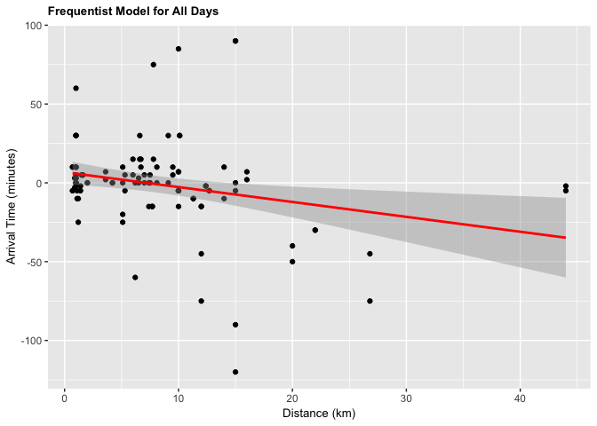<!-- -->

``` r
# Fit the Bayesian model
fit_all_bayes <- brm(arrival ~ distance_km, data = clean_survey_all_days, iter = 5000, cores = -1)
```

``` r
# Return the 95% estimates
fit_all_bayes %>%
    gather_draws(b_Intercept, b_distance_km) %>%
    median_qi() %>%
    select(.variable, .value, .lower, .upper) %>%
    kable()
```

| .variable       |     .value |      .lower |      .upper |
| :-------------- | ---------: | ----------: | ----------: |
| b\_distance\_km | \-0.945458 | \-1.6274472 | \-0.2589073 |
| b\_Intercept    |   6.813558 | \-0.4781286 |  14.1588430 |

``` r
# Plot the Bayesian model
fit_all_bayes %>%
    gather_draws(b_Intercept, b_distance_km) %>%
    ggplot(aes(.value)) +
    geom_density() +
    facet_wrap(~ .variable, scales = 'free') +
    theme(axis.title=element_text(size=10),
          plot.title = element_text(size = 10, face = "bold")) +
    labs(x = 'Value',
         title = 'Bayesian Model for All Days')
```

<!-- -->

``` r
# Anova

# Null model
fit_null_all <- lm(arrival ~ 1, data = clean_survey_all_days)

anova(fit_null_all, fit_all) %>% knitr::kable()
```

| Res.Df |      RSS | Df | Sum of Sq |        F |   Pr(\>F) |
| -----: | -------: | -: | --------: | -------: | --------: |
|    111 | 92516.28 | NA |        NA |       NA |        NA |
|    110 | 86668.11 |  1 |   5848.17 | 7.422554 | 0.0074945 |

Under both frequentist and Bayesian approaches there is an association
between distance and arrival time. For the frequentist approach the
estimate is -0.945 with a confidence interval of 95% (-1.604, -0.257).
For the Bayesian approach the estimate is -0.949 with credible interval
of 95% (-1.639, -0.267).

For every increase of 1 km lived from campus, the expected change in
arrival time is early by almost 1 minute.

### Distance and Arrival Time (Monday & Wednesday)

``` r
fit_mw <- lm(mw_arrival ~ distance_km, data = clean_survey_sep_days)

tidy(fit_mw) %>% 
    bind_cols(confint_tidy(fit_mw, conf.level = 0.95)) %>%
    select(term, estimate, conf.low, conf.high, p.value) %>%
    kable()
```

| term         |    estimate |   conf.low |  conf.high |   p.value |
| :----------- | ----------: | ---------: | ---------: | --------: |
| (Intercept)  |   6.8203611 | \-3.030243 | 16.6709649 | 0.1707956 |
| distance\_km | \-0.8732192 | \-1.763445 |  0.0170068 | 0.0543802 |

``` r
ggplot(clean_survey_sep_days, aes(x = distance_km, y = mw_arrival)) + 
    geom_point() +
    ylab("Arrival Time (minutes)") +
    xlab("Distance (km)") +
    ggtitle("Frequentist Model for Mondays and Wednesdays") +
    theme(axis.title=element_text(size=10),
          plot.title = element_text(size = 10, face = "bold")) +
    stat_smooth(method = "lm", col = "red")
```

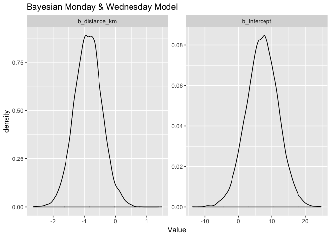<!-- -->

``` r
fit_mw_bayes <- brm(mw_arrival ~ distance_km, data = clean_survey_sep_days, iter = 5000, cores = -1)
```

``` r
fit_mw_bayes %>%
    gather_draws(b_Intercept, b_distance_km) %>%
    median_qi() %>%
    select(.variable, .value, .lower, .upper) %>%
    kable()
```

| .variable       |      .value |     .lower |      .upper |
| :-------------- | ----------: | ---------: | ----------: |
| b\_distance\_km | \-0.8823893 | \-1.748600 | \-0.0145015 |
| b\_Intercept    |   7.2267789 | \-2.074981 |  16.7993213 |

``` r
fit_mw_bayes %>%
    gather_draws(b_Intercept, b_distance_km) %>%
    ggplot(aes(.value)) +
    geom_density() +
    facet_wrap(~ .variable, scales = 'free') +
    theme(axis.title=element_text(size=10),
          plot.title = element_text(size = 10, face = "bold")) +
    labs(x = 'Value',
         title = 'Bayesian Model for Mondays and Wednesdays')
```

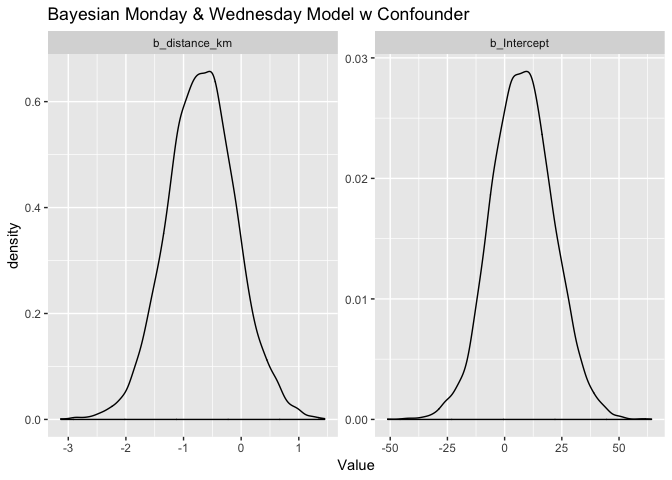<!-- -->

``` r
# Anova

# Null model
fit_null_mw <- lm(mw_arrival ~ 1, data = clean_survey_sep_days)

anova(fit_null_mw, fit_mw) %>% knitr::kable()
```

| Res.Df |      RSS | Df | Sum of Sq |       F |   Pr(\>F) |
| -----: | -------: | -: | --------: | ------: | --------: |
|     55 | 37393.55 | NA |        NA |      NA |        NA |
|     54 | 34894.45 |  1 |  2499.108 | 3.86743 | 0.0543802 |

Under both frequentist and Bayesian approaches there is an association
between distance and arrival time for Mondays and Wednesdays. For the
frequentist approach the estimate is -0.87 with a confidence interval of
95% (-1.76, 0.01). For the Bayesian approach the estimate is -0.87 with
credible interval of 95% (-1.75, 0.01).

### Distance and Arrival Time (Tuesday & Thursday)

``` r
fit_tt <- lm(tt_arrival ~ distance_km, data = clean_survey_sep_days)

tidy(fit_tt) %>% 
    bind_cols(confint_tidy(fit_tt, conf.level = 0.95)) %>%
    select(term, estimate, conf.low, conf.high, p.value) %>%
    kable()
```

| term         |   estimate |   conf.low |  conf.high |   p.value |
| :----------- | ---------: | ---------: | ---------: | --------: |
| (Intercept)  |   6.693060 | \-5.296692 | 18.6828132 | 0.2680140 |
| distance\_km | \-1.015884 | \-2.099431 |  0.0676624 | 0.0655509 |

``` r
ggplot(clean_survey_sep_days, aes(x = distance_km, y = tt_arrival)) + 
    geom_point() +
    ylab("Arrival Time") +
    xlab("Distance") +
    ggtitle("Frequentist Model for Tuesdays and Thursdays") +
    theme(axis.title=element_text(size=10),
          plot.title = element_text(size = 10, face = "bold")) +
    stat_smooth(method = "lm", col = "red")
```

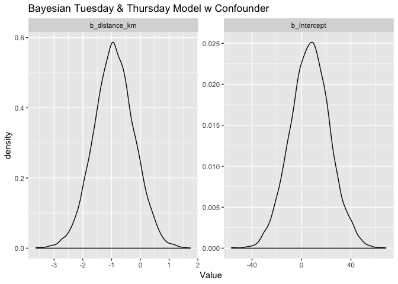<!-- -->

``` r
fit_tt_bayes <- brm(tt_arrival ~ distance_km, data = clean_survey_sep_days, iter = 5000, cores = -1)
```

``` r
fit_tt_bayes %>%
    gather_draws(b_Intercept, b_distance_km) %>%
    median_qi() %>%
    select(.variable, .value, .lower, .upper) %>%
    kable()
```

| .variable       |     .value |     .lower |    .upper |
| :-------------- | ---------: | ---------: | --------: |
| b\_distance\_km | \-1.005564 | \-2.083920 |  0.057023 |
| b\_Intercept    |   6.790990 | \-4.143348 | 18.262045 |

``` r
fit_tt_bayes %>%
    gather_draws(b_Intercept, b_distance_km) %>%
    ggplot(aes(.value)) +
    geom_density() +
    facet_wrap(~ .variable, scales = 'free') +
    theme(axis.title=element_text(size=10),
          plot.title = element_text(size = 10, face = "bold")) +
    labs(x = 'Value',
         title = 'Bayesian Model for Tuesdays and Thursdays')
```

<!-- -->

``` r
# Anova

# Null model
fit_null_tt <- lm(tt_arrival ~ 1, data = clean_survey_sep_days)

anova(fit_null_tt, fit_tt) %>% knitr::kable()
```

| Res.Df |      RSS | Df | Sum of Sq |        F |   Pr(\>F) |
| -----: | -------: | -: | --------: | -------: | --------: |
|     55 | 55077.71 | NA |        NA |       NA |        NA |
|     54 | 51695.30 |  1 |  3382.416 | 3.533212 | 0.0655509 |

Under both frequentist and Bayesian approaches there is *not* an
association between distance and arrival time for Tuesdays and
Thursdays. For the frequentist approach the estimate is -1.02 with a
confidence interval of 95% (-2.1, 0.0677). For the Bayesian approach the
estimate is -1.02 with credible interval of 95% (-2.05,
0.02).

## With Confounders

### Distance and Arrival Time (Overall)

``` r
fit_all_transp <- lm(arrival ~ distance_km + mode_of_transport, data = clean_survey_all_days)
```

``` r
ggplot(clean_survey_all_days, aes(x = distance_km, y = arrival)) + 
    geom_point() +
    ylab("Arrival Time (minutes)") +
    xlab("Distance (km)") +
    ggtitle("Frequentist Model for All Days by Mode of Transit") +
    facet_wrap(~ mode_of_transport, nrow = 4) +
    theme(axis.title=element_text(size=10),
          plot.title = element_text(size = 10, face = "bold")) +
    geom_smooth(method = 'lm', col = 'red')
```

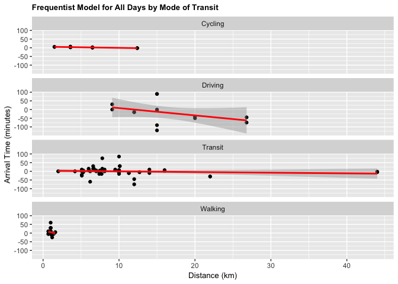<!-- -->

``` r
fit_all_bayes_transp <- brm(arrival ~ distance_km + mode_of_transport, data = clean_survey_all_days, iter = 5000, cores = -1)
```

``` r
fit_all_bayes_transp%>%
    gather_draws(b_Intercept, b_distance_km, b_mode_of_transportDriving, b_mode_of_transportTransit, b_mode_of_transportWalking) %>%
    ggplot(aes(.value)) +
    geom_density() +
    facet_wrap(~ .variable, scales = 'free') +
    labs(x = 'Value',
         title = 'Bayesian Model for All Days by Mode of Transit') +
    theme(axis.title=element_text(size=10),
          plot.title = element_text(size = 10, face = "bold"))
```

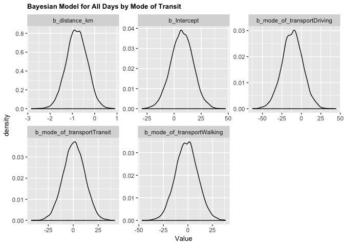<!-- -->

Under both frequentist and Bayesian approaches there is an association
between distance and arrival time when including confounders. We can
compare the two estimates in the tables below:

#### Frequentist

``` r
tidy(fit_all_transp) %>% 
    bind_cols(confint_tidy(fit_all_transp, conf.level = 0.95)) %>%
    select(term, estimate, conf.low, conf.high, p.value) %>%
    kable()
```

| term                       |     estimate |    conf.low |  conf.high |   p.value |
| :------------------------- | -----------: | ----------: | ---------: | --------: |
| (Intercept)                |    7.0621190 | \-13.438025 | 27.5622628 | 0.4961374 |
| distance\_km               |  \-0.8020198 |  \-1.711544 |  0.1075044 | 0.0833205 |
| mode\_of\_transportDriving | \-11.6266849 | \-38.055241 | 14.8018711 | 0.3851024 |
| mode\_of\_transportTransit |    0.7494133 | \-20.664819 | 22.1636458 | 0.9448202 |
| mode\_of\_transportWalking |  \-1.3287860 | \-23.879118 | 21.2215461 | 0.9072275 |

#### Bayesian

``` r
fit_all_bayes_transp  %>%
    gather_draws(b_Intercept, b_distance_km, b_mode_of_transportDriving, b_mode_of_transportTransit, b_mode_of_transportWalking) %>%
    median_qi() %>%
    select(.variable, .value, .lower, .upper) %>%
    kable()
```

| .variable                     |       .value |      .lower |     .upper |
| :---------------------------- | -----------: | ----------: | ---------: |
| b\_distance\_km               |  \-0.8062015 |  \-1.709988 |  0.0865267 |
| b\_Intercept                  |    7.1928996 | \-13.062709 | 27.0941657 |
| b\_mode\_of\_transportDriving | \-11.3238895 | \-37.880200 | 14.8126709 |
| b\_mode\_of\_transportTransit |    0.8297292 | \-20.247359 | 21.4466043 |
| b\_mode\_of\_transportWalking |  \-1.3404199 | \-23.226197 | 21.0628003 |

### Distance and Arrival Time (Monday & Wednesday)

``` r
fit_mw_transp <- lm(mw_arrival ~ distance_km + mode_of_transport, data = clean_survey_sep_days)
```

``` r
ggplot(clean_survey_sep_days, aes(x = distance_km, y = mw_arrival)) + 
    geom_point() +
    ylab("Arrival Time (minutes)") +
    xlab("Distance (km)") +
    ggtitle("Frequentist Model for Mondays and Wednesdays by Mode of Transit") +
    theme(axis.title=element_text(size=10),
          plot.title = element_text(size = 10, face = "bold")) +
    facet_wrap(~ mode_of_transport, nrow = 4) +
    geom_smooth(method = 'lm', col = 'red')
```

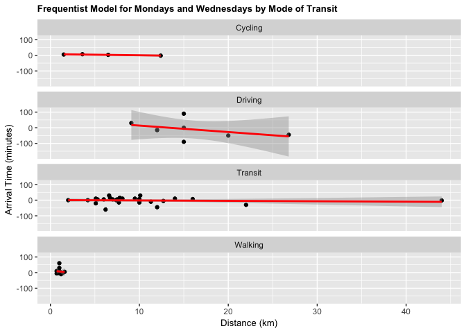<!-- -->

``` r
fit_mw_bayes_transp <- brm(mw_arrival ~ distance_km + mode_of_transport, data = clean_survey_sep_days, iter = 5000, cores = -1)
```

``` r
fit_mw_bayes_transp %>%
    gather_draws(b_Intercept, b_distance_km, b_mode_of_transportDriving, 
                 b_mode_of_transportTransit, b_mode_of_transportWalking) %>%
    median_qi() %>%
    kable()
```

| .variable                     |     .value |      .lower |     .upper | .width | .point | .interval |
| :---------------------------- | ---------: | ----------: | ---------: | -----: | :----- | :-------- |
| b\_distance\_km               | \-0.685351 |  \-1.861418 |  0.5243001 |   0.95 | median | qi        |
| b\_Intercept                  |   7.715667 | \-18.251692 | 34.1053283 |   0.95 | median | qi        |
| b\_mode\_of\_transportDriving | \-7.866724 | \-42.064087 | 26.1549160 |   0.95 | median | qi        |
| b\_mode\_of\_transportTransit | \-2.410431 | \-30.286897 | 25.1189073 |   0.95 | median | qi        |
| b\_mode\_of\_transportWalking |   0.258534 | \-29.026678 | 29.1893390 |   0.95 | median | qi        |

``` r
fit_mw_bayes_transp %>%
    gather_draws(b_Intercept, b_distance_km, b_mode_of_transportDriving, 
                 b_mode_of_transportTransit, b_mode_of_transportWalking) %>%
    ggplot(aes(.value)) +
    geom_density() +
    facet_wrap(~ .variable, scales = 'free') +
    labs(x = 'Value',
         title = 'Bayesian Model for Mondays and Wednesdays by Mode of Transit') +
    theme(axis.title=element_text(size=10),
          plot.title = element_text(size = 10, face = "bold"))
```

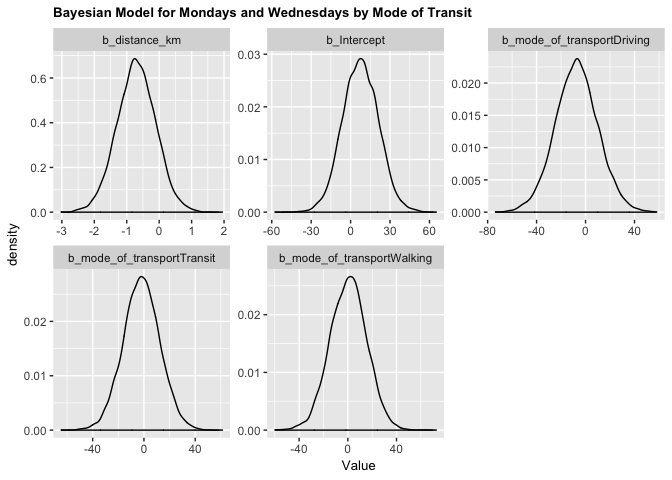<!-- -->

Under both frequentist and Bayesian approaches there is an association
between distance and arrival time for Monday & Wednesday when including
confounders. We can compare the two estimates in the tables below:

#### Frequentist

``` r
tidy(fit_mw_transp)%>% 
    bind_cols(confint_tidy(fit_mw_transp, conf.level = 0.95)) %>%
    select(term, estimate, conf.low, conf.high, p.value) %>%
    kable()
```

| term                       |    estimate |    conf.low |  conf.high |   p.value |
| :------------------------- | ----------: | ----------: | ---------: | --------: |
| (Intercept)                |   7.3754923 | \-19.779601 | 34.5305861 | 0.5879432 |
| distance\_km               | \-0.6875821 |  \-1.892365 |  0.5172004 | 0.2572468 |
| mode\_of\_transportDriving | \-7.7143475 | \-42.722391 | 27.2936955 | 0.6600777 |
| mode\_of\_transportTransit | \-2.2253062 | \-30.591229 | 26.1406164 | 0.8754767 |
| mode\_of\_transportWalking |   0.2710767 | \-29.599757 | 30.1419103 | 0.9855354 |

#### Bayesian

``` r
fit_mw_bayes_transp %>%
    gather_draws(b_Intercept, b_distance_km, b_mode_of_transportDriving, 
                 b_mode_of_transportTransit, b_mode_of_transportWalking) %>%
    median_qi() %>%
    kable()
```

| .variable                     |      .value |      .lower |     .upper | .width | .point | .interval |
| :---------------------------- | ----------: | ----------: | ---------: | -----: | :----- | :-------- |
| b\_distance\_km               | \-0.7055596 |  \-1.887498 |  0.4730413 |   0.95 | median | qi        |
| b\_Intercept                  |   7.4358140 | \-18.963560 | 34.2652938 |   0.95 | median | qi        |
| b\_mode\_of\_transportDriving | \-7.3234191 | \-41.998752 | 27.4917706 |   0.95 | median | qi        |
| b\_mode\_of\_transportTransit | \-1.8910983 | \-30.076817 | 25.9920385 |   0.95 | median | qi        |
| b\_mode\_of\_transportWalking |   0.6394130 | \-28.790616 | 29.5731715 |   0.95 | median | qi        |

### Distance and Arrival Time (Tuesday & Thursday)

``` r
fit_tt_transp <- lm(tt_arrival ~ distance_km + mode_of_transport, data = clean_survey_sep_days)
```

``` r
ggplot(clean_survey_sep_days, aes(x = distance_km, y = tt_arrival)) + 
    geom_point() +
    ylab("Arrival Time (minutes)") +
    xlab("Distance (km)") +
    ggtitle("Frequentist Model for Tuesdays and Thursdays by Mode of Transit") +
    theme(axis.title=element_text(size=10),
          plot.title = element_text(size = 10, face = "bold")) +
    facet_wrap(~ mode_of_transport, nrow = 4) +
    geom_smooth(method = 'lm', col = 'red')
```

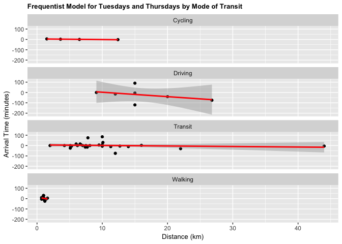<!-- -->

``` r
fit_tt_bayes_transp <- brm(tt_arrival ~ distance_km + mode_of_transport, data = clean_survey_sep_days, iter = 5000, cores = -1)
```

``` r
fit_tt_bayes_transp %>%
    gather_draws(b_Intercept, b_distance_km, b_mode_of_transportDriving, b_mode_of_transportTransit, b_mode_of_transportWalking) %>%
    ggplot(aes(.value)) +
    geom_density() +
    facet_wrap(~ .variable, scales = 'free') +
    labs(x = 'Value',
         title = 'Bayesian Model for Tuesdays and Thursdays by Mode of Transit') +
    theme(axis.title=element_text(size=10),
          plot.title = element_text(size = 10, face = "bold"))
```

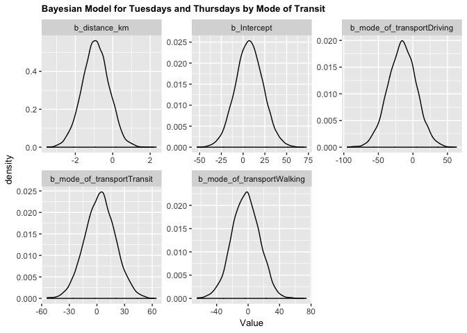<!-- -->

Under both frequentist and Bayesian approaches there is an association
between distance and arrival time for Tuesdays and Thursdays when
including confounders. We can compare the two estimates in the tables
below:

#### Frequentist

``` r
tidy(fit_tt_transp)%>% 
    bind_cols(confint_tidy(fit_tt_transp, conf.level = 0.95)) %>%
    select(term, estimate, conf.low, conf.high, p.value) %>%
    kable()
```

| term                       |     estimate |    conf.low | conf.high |   p.value |
| :------------------------- | -----------: | ----------: | --------: | --------: |
| (Intercept)                |    6.7487456 | \-25.706900 | 39.204391 | 0.6781001 |
| distance\_km               |  \-0.9164576 |  \-2.356408 |  0.523493 | 0.2071309 |
| mode\_of\_transportDriving | \-15.5390222 | \-57.380478 | 26.302433 | 0.4593476 |
| mode\_of\_transportTransit |    3.7241328 | \-30.178690 | 37.626956 | 0.8263407 |
| mode\_of\_transportWalking |  \-2.9286487 | \-38.630135 | 32.772837 | 0.8698427 |

#### Bayesian

``` r
fit_tt_bayes_transp %>%
    gather_draws(b_Intercept, b_distance_km, b_mode_of_transportDriving, 
                 b_mode_of_transportTransit, b_mode_of_transportWalking) %>%
    median_qi() %>%
    kable()
```

| .variable                     |       .value |      .lower |     .upper | .width | .point | .interval |
| :---------------------------- | -----------: | ----------: | ---------: | -----: | :----- | :-------- |
| b\_distance\_km               |  \-0.9139256 |  \-2.339484 |  0.4792605 |   0.95 | median | qi        |
| b\_Intercept                  |    7.0934652 | \-23.604995 | 38.5345952 |   0.95 | median | qi        |
| b\_mode\_of\_transportDriving | \-15.4139574 | \-55.964672 | 24.2819315 |   0.95 | median | qi        |
| b\_mode\_of\_transportTransit |    3.5067255 | \-28.655637 | 36.4168577 |   0.95 | median | qi        |
| b\_mode\_of\_transportWalking |  \-2.9880175 | \-38.104121 | 30.7084226 |   0.95 | median | qi        |

# Discussion of the results

From our results we can see that there is a relationship between how far
someone lives from campus and their arrival time. This was found overall
and for the two groups of days (Mondays-Wednesdays, Tuesdays-Thursdays).
Given the consistency between methods in both the estimates achieved and
the confidence/credible intervals allows us to infer that there is an
association between how far someone lives from campus and their time of
arrival. This picture changed when including mode of transport as our
confounder in the analysis. When doing this component, we could observe
that mode of transport doesn’t have an effect as a confounder as our
estimates didn’t change to be outside of the confidence/credible
intervals of the first estimates. This phenomena remained both for the
overall analysis and for the focused analysis in the groups of days.

# Discussion of the survey/study design

  - what did you do well to make this study as causal as possible?

We included mode of transportation as a potential confounding variable
when setting up our study. We included this question in our survey so
that we could collect this data from the beginning.

  - what was not done well and how did that effect your studies
    conclusions?

We could have included potential additional confounders. This may or may
not have affected our conclusions.

  - what would you do differently next time to improve your survey/study
    design and why?

We would ask students about their habits before coming to class (e.g.,
do you eat breakfast, stop for coffee, etc.?).
