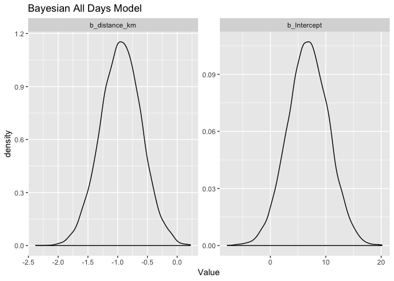
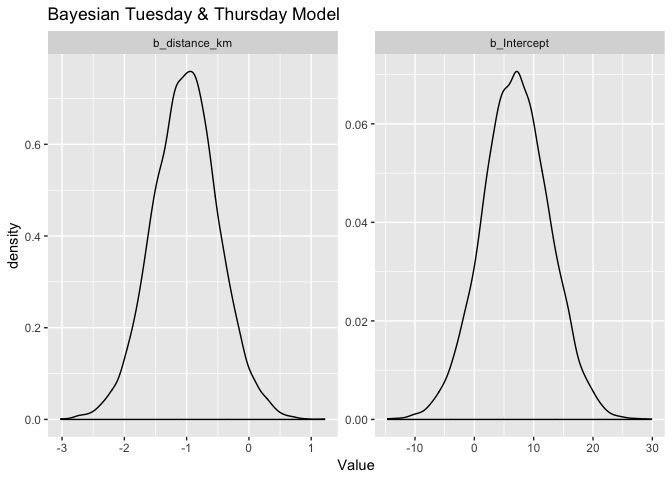
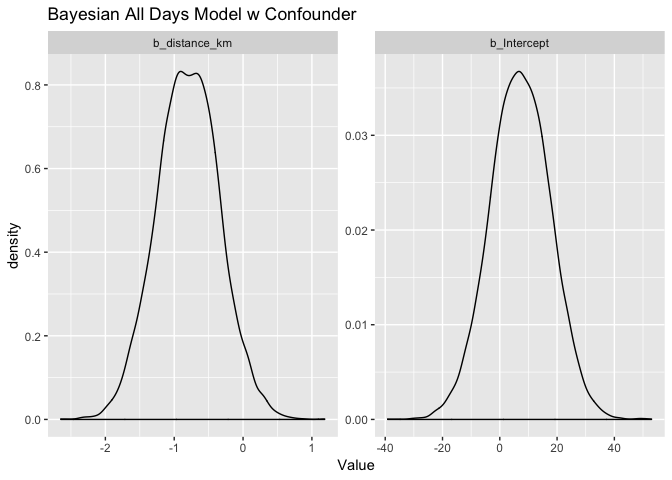
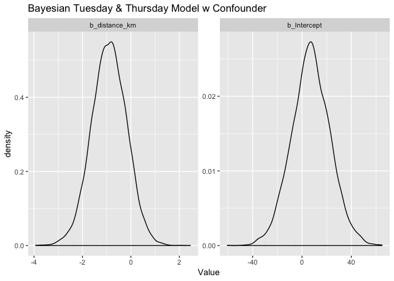

Survey Analysis Arrival Time
================
Akansha Vashisth, Ian Flores Siaca, Rachel K. Riggs, Milos Milic
2019-04-13

## Libraries

``` r
library(tidyverse)
library(tidybayes)
library(brms)
library(broom)
library(knitr)
library(gridExtra)
```

## Load the data

``` r
clean_survey_all_days <- read_csv('https://raw.githubusercontent.com/UBC-MDS/survey_arrival_time/master/data/clean_survey_responses_all_days.csv')
clean_survey_sep_days <- read_csv('https://raw.githubusercontent.com/UBC-MDS/survey_arrival_time/master/data/clean_survey_responses_sep_days.csv')
```

# Survey question

**How does distance from campus influence arrival time to lectures?**

We conducted an observational study to explore if there is a
relationship between the distance lived from class and arrival time. We
also wanted to test a potential confounder for this relationship which
is the mode of transportation a student takes to class.

# Methods

## Survey study design

We asked our survey respondents to answer the following questions:

  - How far from Hugh Dempster do you live in kilometers via the mode of
    transport you use(a google maps link was provided to help with the
    distance estimation)?

  - What time do you typically arrive at Hugh Dempster on Mondays and
    Wednesdays? please enter in the format hh:mm

  - What time do you typically arrive at Hugh Dempster on Mondays and
    Wednesdays? please enter in the format hh:mm

  - What is your typical mode of transit? (drive, public transit, walk,
    or bike)

## Data collection methods

Data was collected by this
[survey](https://ubc.ca1.qualtrics.com/jfe/form/SV_eo1whP0fPfWPCw5)
hosted by Qualtrics. The survey had 56 participants from the MDS
students 2018-2019 cohort and responses were anonymized.

## Analysis methods

We performed initial [exploratory data
analysis](https://github.com/UBC-MDS/survey_arrival_time/blob/v2.0/milestone2.md)
on our data.

To analyze the data, we consider 3 groups:

  - all days grouped together

  - Mondays and Wednesdays together

  - Tuesdays and Thursdays together

Below we fit a linear regression using the distance as the predictor
variable and the arrival time as the response variable. We compare this
linear regression model with a null model through an ANOVA test. To
validate the estimates of the frequentist approach, given the
possibility of a small sample size, we use a Bayesian linear regression.
After this, we will move on to using the mode of transportation as a
confounder variable and fit a linear regression model with these
variables. We will compare this model with the null model through an
ANOVA test, and again validate using a Bayesian linear regression.

# EDA

``` r
plot1 <- clean_survey_all_days %>%
  ggplot(height = 17 , width = 2) +
  geom_histogram(aes(x=distance_km)) + 
  theme(axis.title=element_text(size=10),
        plot.title = element_text(size = 10, face = "bold")) +  
  labs(y= "Frequency", x = "Distance (in km)", title = "Distribution of Distance Lived From Campus (km)") 

plot2 <- clean_survey_all_days %>%
  ggplot() +
  geom_histogram(aes(x=arrival)) +  
  theme(axis.title=element_text(size=10),
        plot.title = element_text(size = 10, face = "bold")) +  
  labs(y= "Frequency", x = "Arrival time", title = "Distribution of Arrival Time (minutes)") 

grid.arrange(plot1, plot2, ncol=2)
```

<!-- -->

We can see that the majority of students live within 15 kilometers of
campus, and that the majority arrive within 30 mintues before and 30
minutes after the start of the lecture.

``` r
plot3 <- clean_survey_all_days %>%
  ggplot() +
  geom_bar(aes(x=mode_of_transport)) +
  theme(axis.title=element_text(size=10),
        plot.title = element_text(size = 10, face = "bold")) +  
  labs(y= "Frequency", x = "Mode of transport", title = "Number of MDS Students using different modes of transport") 
plot3
```

<!-- -->

Comparing modes of transit, we see that transit is the most common form
of transportation, while cycling is the least.

Does there appear to be a relationship between arrival time and distance
lived from campus? An intial plot shows us:

``` r
plot4 <- clean_survey_all_days %>%
  ggplot(aes(x = arrival, y = distance_km)) +
  geom_point() +
  theme(axis.title=element_text(size=10),
        plot.title = element_text(size = 10, face = "bold")) +  
  labs(x = "Arrival time (minutes)", y = "Distance (km)", title = "Arrival Time vs Distance Lived From Campus") 
plot4
```

<!-- -->

It’s difficult to discern from this plot so we will further explore this
question in the analysis below.

``` r
plot5 <- clean_survey_sep_days %>% 
  ggplot(aes(x = mw_arrival)) +
  geom_density(aes(fill = "salmon", color = "salmon"), alpha = .3) + 
  geom_density(aes(x = tt_arrival, fill = "#00BFC4", color = "#00BFC4"), alpha = .3) +
  facet_wrap(~ mode_of_transport) +
  theme(axis.title=element_text(size=10),
        plot.title = element_text(size = 10, face = "bold")) +
  labs(x="Arrival time", y="Frequency", title = "Density of student arrival time on Mon & Wed vs Tues & Thurs") +
  guides(color = FALSE) +
  scale_fill_identity(name = "days",
                       breaks = c("salmon", "#00BFC4"),
                       labels = c("Mon-Wed", "Tues-Thurs"),
                       guide = "legend")
plot5
```

<!-- -->

Comparing this distribution of arrival times on Mondays and Wednesday vs
Tuesdays and Thursdays reveals that there is only a slight difference in
arrival time when the lectures start at 09:00 compared when the lecture
starts at 09:30. It is most noticeable for students taking transit.

# Analysis and results

## Without Confounders

### Distance and Arrival Time (Overall)

``` r
# Frequentist
fit_all <- lm(arrival ~ distance_km, data = clean_survey_all_days)

tidy(fit_all) %>% 
    kable()
```

| term         |    estimate | std.error |  statistic |   p.value |
| :----------- | ----------: | --------: | ---------: | --------: |
| (Intercept)  |   6.7567108 | 3.8362921 |   1.761261 | 0.0809729 |
| distance\_km | \-0.9445517 | 0.3466962 | \-2.724436 | 0.0074945 |

As per frequentist approach there is an association between distance and
arrival time with a confidence interval of 95% (-1.604, -0.277).

For every increase of 1 km lived from campus, the expected change in
arrival time is early by almost 1 minute.

``` r
# Returns the 95% estimates
fit_all_bayes %>%
    gather_draws(b_Intercept, b_distance_km, sigma) %>%
    median_qi() %>%
    kable()
```

| .variable       |      .value |      .lower |      .upper | .width | .point | .interval |
| :-------------- | ----------: | ----------: | ----------: | -----: | :----- | :-------- |
| b\_distance\_km | \-0.9429601 | \-1.6205055 | \-0.2639359 |   0.95 | median | qi        |
| b\_Intercept    |   6.8211231 | \-0.4642215 |  14.0761122 |   0.95 | median | qi        |
| sigma           |  27.8864838 |  24.5390591 |  32.0351478 |   0.95 | median | qi        |

As per bayesian approach (Ian could you please take over from here)

``` r
fit_all_bayes %>%
    gather_draws(b_Intercept, b_distance_km) %>%
    ggplot(aes(.value)) +
    geom_density() +
    facet_wrap(~ .variable, scales = 'free') +
    labs(x = 'Value',
         title = 'Bayesian All Days Model')
```

<!-- -->

### Distance and Arrival Time (Monday & Wednesday)

``` r
fit_mw <- lm(mw_arrival ~ distance_km, data = clean_survey_sep_days)

tidy(fit_mw) %>% 
    kable()
```

| term         |    estimate | std.error |  statistic |   p.value |
| :----------- | ----------: | --------: | ---------: | --------: |
| (Intercept)  |   6.8203611 | 4.9133152 |   1.388138 | 0.1707956 |
| distance\_km | \-0.8732192 | 0.4440297 | \-1.966578 | 0.0543802 |

``` r
fit_mw_bayes %>%
    gather_draws(b_Intercept, b_distance_km, sigma) %>%
    median_qi() %>%
    kable()
```

| .variable       |      .value |     .lower |     .upper | .width | .point | .interval |
| :-------------- | ----------: | ---------: | ---------: | -----: | :----- | :-------- |
| b\_distance\_km | \-0.8735837 | \-1.737936 |  0.0158947 |   0.95 | median | qi        |
| b\_Intercept    |   7.1398526 | \-2.220549 | 16.2738603 |   0.95 | median | qi        |
| sigma           |  25.1549734 |  21.084387 | 30.4964136 |   0.95 | median | qi        |

``` r
fit_mw_bayes %>%
    gather_draws(b_Intercept, b_distance_km) %>%
    ggplot(aes(.value)) +
    geom_density() +
    facet_wrap(~ .variable, scales = 'free') +
    labs(x = 'Value',
         title = 'Bayesian Monday & Wednesday Model')
```

<!-- -->

### Distance and Arrival Time (Tuesday and Thursdays)

``` r
fit_tt <- lm(tt_arrival ~ distance_km, data = clean_survey_sep_days)

tidy(fit_tt) %>% 
    kable()
```

| term         |   estimate | std.error |  statistic |   p.value |
| :----------- | ---------: | --------: | ---------: | --------: |
| (Intercept)  |   6.693060 | 5.9802866 |   1.119187 | 0.2680140 |
| distance\_km | \-1.015884 | 0.5404548 | \-1.879684 | 0.0655509 |

``` r
fit_tt_bayes %>%
    gather_draws(b_Intercept, b_distance_km, sigma) %>%
    median_qi() %>%
    kable()
```

| .variable       |     .value |     .lower |     .upper | .width | .point | .interval |
| :-------------- | ---------: | ---------: | ---------: | -----: | :----- | :-------- |
| b\_distance\_km | \-1.012167 | \-2.062502 |  0.0491413 |   0.95 | median | qi        |
| b\_Intercept    |   6.989803 | \-4.225077 | 18.2405997 |   0.95 | median | qi        |
| sigma           |  30.530694 |  25.633246 | 37.1528404 |   0.95 | median | qi        |

``` r
fit_tt_bayes %>%
    gather_draws(b_Intercept, b_distance_km) %>%
    ggplot(aes(.value)) +
    geom_density() +
    facet_wrap(~ .variable, scales = 'free') +
    labs(x = 'Value',
         title = 'Bayesian Tuesday & Thursday Model')
```

<!-- -->

## With Confounders

### Distance and Arrival Time (Overall)

``` r
fit_all_transp <- lm(arrival ~ distance_km + mode_of_transport, data = clean_survey_all_days)

tidy(fit_all_transp) %>% 
    kable()
```

| term                       |     estimate |  std.error |   statistic |   p.value |
| :------------------------- | -----------: | ---------: | ----------: | --------: |
| (Intercept)                |    7.0621190 | 10.3411601 |   0.6829136 | 0.4961374 |
| distance\_km               |  \-0.8020198 |  0.4588034 | \-1.7480687 | 0.0833205 |
| mode\_of\_transportDriving | \-11.6266849 | 13.3317079 | \-0.8721077 | 0.3851024 |
| mode\_of\_transportTransit |    0.7494133 | 10.8022660 |   0.0693756 | 0.9448202 |
| mode\_of\_transportWalking |  \-1.3287860 | 11.3753639 | \-0.1168126 | 0.9072275 |

``` r
# Returns the 95% estimates
fit_all_bayes_transp %>%
    gather_draws(b_Intercept, b_distance_km, sigma) %>%
    median_qi() %>%
    kable()
```

| .variable       |      .value |      .lower |     .upper | .width | .point | .interval |
| :-------------- | ----------: | ----------: | ---------: | -----: | :----- | :-------- |
| b\_distance\_km | \-0.7982526 |  \-1.684084 |  0.0955237 |   0.95 | median | qi        |
| b\_Intercept    |   7.1047176 | \-13.520277 | 27.4972762 |   0.95 | median | qi        |
| sigma           |  28.0312226 |   24.820313 | 32.1245977 |   0.95 | median | qi        |

``` r
fit_all_bayes_transp %>%
    gather_draws(b_Intercept, b_distance_km) %>%
    ggplot(aes(.value)) +
    geom_density() +
    facet_wrap(~ .variable, scales = 'free') +
    labs(x = 'Value',
         title = 'Bayesian All Days Model w Confounder')
```

<!-- -->

### Distance and Arrival Time (Monday & Wednesday)

``` r
fit_mw_transp <- lm(mw_arrival ~ distance_km + mode_of_transport, data = clean_survey_sep_days)

tidy(fit_mw_transp) %>% 
    kable()
```

| term                       |    estimate |  std.error |   statistic |   p.value |
| :------------------------- | ----------: | ---------: | ----------: | --------: |
| (Intercept)                |   7.3754923 | 13.5262569 |   0.5452722 | 0.5879432 |
| distance\_km               | \-0.6875821 |  0.6001157 | \-1.1457492 | 0.2572468 |
| mode\_of\_transportDriving | \-7.7143475 | 17.4378990 | \-0.4423897 | 0.6600777 |
| mode\_of\_transportTransit | \-2.2253062 | 14.1293843 | \-0.1574949 | 0.8754767 |
| mode\_of\_transportWalking |   0.2710767 | 14.8789974 |   0.0182187 | 0.9855354 |

``` r
fit_mw_bayes_transp %>%
    gather_draws(b_Intercept, b_distance_km, sigma) %>%
    median_qi() %>%
    kable()
```

| .variable       |      .value |      .lower |     .upper | .width | .point | .interval |
| :-------------- | ----------: | ----------: | ---------: | -----: | :----- | :-------- |
| b\_distance\_km | \-0.6922013 |  \-1.871178 |  0.4981872 |   0.95 | median | qi        |
| b\_Intercept    |   7.4398559 | \-19.677455 | 34.0399350 |   0.95 | median | qi        |
| sigma           |  25.7666860 |   21.505672 | 31.5487118 |   0.95 | median | qi        |

``` r
fit_mw_bayes_transp %>%
    gather_draws(b_Intercept, b_distance_km) %>%
    ggplot(aes(.value)) +
    geom_density() +
    facet_wrap(~ .variable, scales = 'free') +
    labs(x = 'Value',
         title = 'Bayesian Monday & Wednesday Model w Confounder')
```

<!-- -->

### Distance and Arrival Time (Tuesday and Thursdays)

``` r
fit_tt_transp <- lm(tt_arrival ~ distance_km + mode_of_transport, data = clean_survey_sep_days)

tidy(fit_tt_transp) %>% 
    kable()
```

| term                       |     estimate |  std.error |   statistic |   p.value |
| :------------------------- | -----------: | ---------: | ----------: | --------: |
| (Intercept)                |    6.7487456 | 16.1665213 |   0.4174519 | 0.6781001 |
| distance\_km               |  \-0.9164576 |  0.7172556 | \-1.2777281 | 0.2071309 |
| mode\_of\_transportDriving | \-15.5390222 | 20.8416984 | \-0.7455737 | 0.4593476 |
| mode\_of\_transportTransit |    3.7241328 | 16.8873765 |   0.2205276 | 0.8263407 |
| mode\_of\_transportWalking |  \-2.9286487 | 17.7833107 | \-0.1646852 | 0.8698427 |

``` r
fit_tt_bayes_transp %>%
    gather_draws(b_Intercept, b_distance_km, sigma) %>%
    median_qi() %>%
    kable()
```

| .variable       |     .value |      .lower |     .upper | .width | .point | .interval |
| :-------------- | ---------: | ----------: | ---------: | -----: | :----- | :-------- |
| b\_distance\_km | \-0.894366 |  \-2.330475 |  0.5004796 |   0.95 | median | qi        |
| b\_Intercept    |   7.092545 | \-23.548373 | 38.3353151 |   0.95 | median | qi        |
| sigma           |  30.717506 |   25.723497 | 37.5511880 |   0.95 | median | qi        |

``` r
fit_tt_bayes_transp %>%
    gather_draws(b_Intercept, b_distance_km) %>%
    ggplot(aes(.value)) +
    geom_density() +
    facet_wrap(~ .variable, scales = 'free') +
    labs(x = 'Value',
         title = 'Bayesian Tuesday & Thursday Model w Confounder')
```

<!-- -->

# Discussion of the results

# Discussion of the survey/study design
